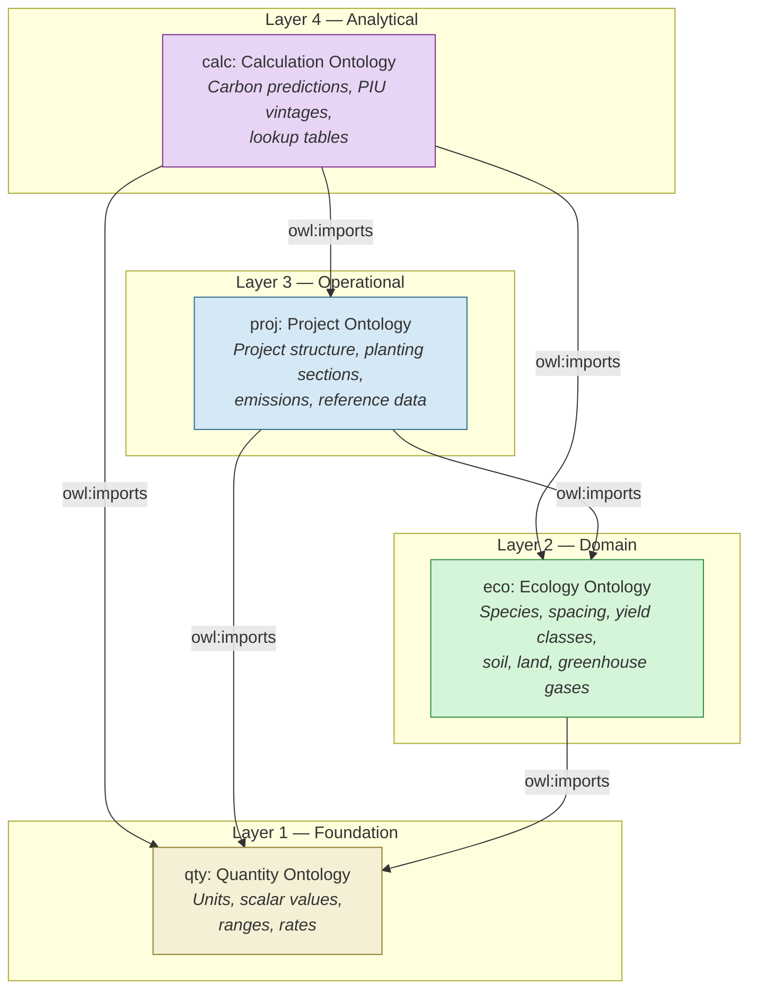
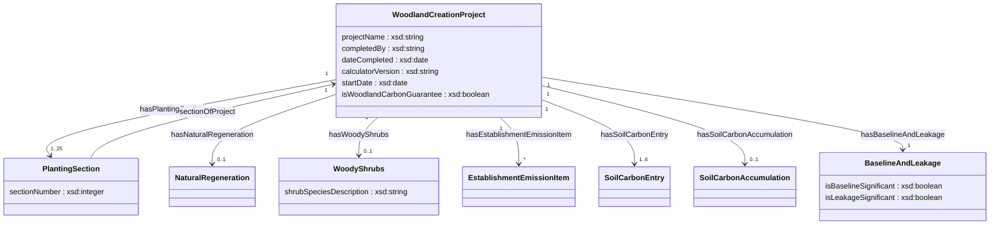
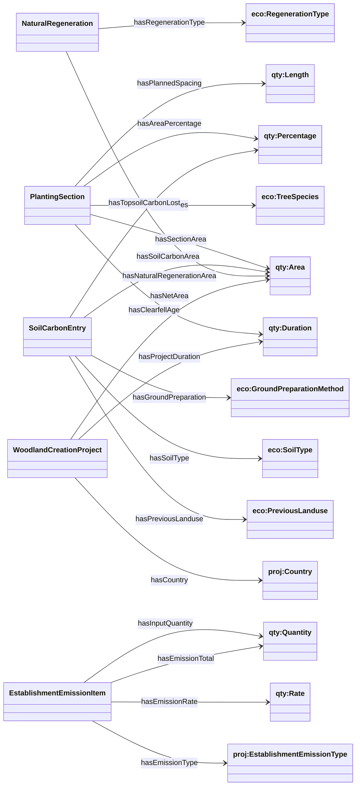
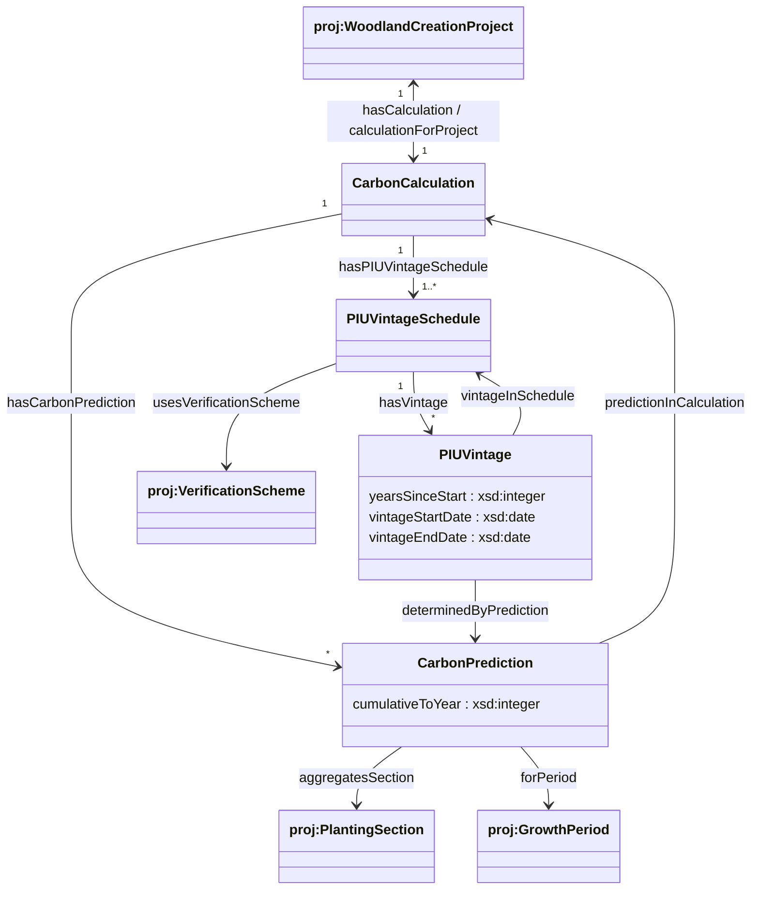
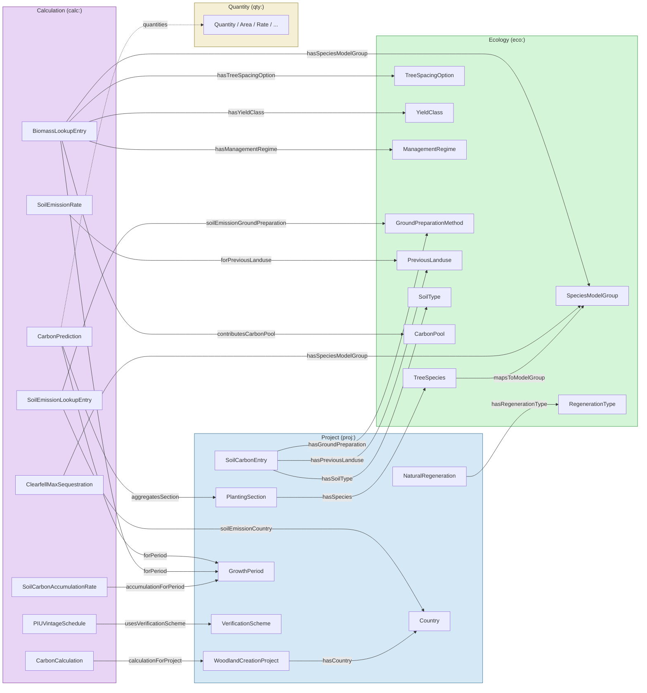

# Woodland Carbon Code — Data Model

This document describes the data model defined by the four OWL ontologies that underpin the Woodland Carbon Code (WCC) carbon calculator. It explains what each entity represents in the real world, how entities relate to each other, and why each matters for carbon accounting. All ontologies are at version **2.0.0** and are serialised in Turtle (`.ttl`) format under [`docs/ontologies/`](ontologies/).

---

## Table of Contents

1. [Overview](#overview)
2. [Ontology Architecture](#ontology-architecture)
3. [Namespace Reference](#namespace-reference)
4. [Quantity Ontology (`qty:`)](#quantity-ontology)
5. [Ecology Ontology (`eco:`)](#ecology-ontology)
6. [Project Ontology (`proj:`)](#project-ontology)
7. [Calculation Ontology (`calc:`)](#calculation-ontology)
8. [Cross-Ontology Relationships](#cross-ontology-relationships)

---

## Overview

### What is the Woodland Carbon Code?

The **Woodland Carbon Code** (WCC) is the UK's voluntary standard for woodland creation projects that sequester atmospheric carbon dioxide. It is administered by Scottish Forestry and underpinned by the UK Land Carbon Registry. When a landowner plants new trees, the growing woodland absorbs CO₂ from the atmosphere and locks it away in the wood, roots, leaf litter, and soil. The WCC provides a scientifically rigorous framework for **predicting** how much carbon a proposed woodland will capture over its lifetime (up to 100 years), and for issuing tradeable carbon units — called **Pending Issuance Units (PIUs)** — that represent those predicted future carbon gains.

The carbon calculator sits at the heart of this process. A project developer describes their proposed woodland — which species, how many hectares, what spacing between trees, what the land was used for before — and the calculator produces a year-by-year prediction of net carbon sequestration after accounting for emissions caused by establishing the woodland, soil disturbance, and risk buffers.

### Why a data model?

The calculator must combine many different types of information: ecological facts about tree species and their growth rates, physical details about the project site, scientifically derived lookup tables, and the rules of the WCC standard itself. The data model formalises all of these into a coherent structure with clear definitions, so that every value in the calculation can be traced back to its origin and meaning.

### Model structure

The data model is structured as four layered ontologies, each building on the one below:

| Layer | Ontology | What it covers |
|-------|----------|----------------|
| 1 (Foundation) | **Quantity** | How we express measurements — areas in hectares, lengths in metres, rates in tCO₂e per hectare, and so on. |
| 2 (Domain) | **Ecology** | The natural world: tree species and how they grow, soil types, previous land use, greenhouse gases, and carbon pools. |
| 3 (Operational) | **Project** | The human activity: a woodland creation project with its planting plan, site preparation, and administrative context. |
| 4 (Analytical) | **Calculation** | The science-based predictions: carbon sequestration forecasts, lookup tables derived from forestry research, and the carbon unit issuance schedule. |

The import chain is strictly linear — each layer imports the one below — ensuring clean separation of concerns. The ecology ontology can be used without knowing anything about projects; a project can be described without running any calculations.

---

## Ontology Architecture

The following diagram shows the four ontologies and their import relationships:



---

## Namespace Reference

| Prefix | Namespace IRI | Ontology File |
|--------|--------------|---------------|
| `qty:` | `https://data.carbon-calculator.co.uk/ontologies/quantity#` | [`quantity.ttl`](ontologies/quantity.ttl) |
| `eco:` | `https://data.carbon-calculator.co.uk/ontologies/ecology#` | [`ecology.ttl`](ontologies/ecology.ttl) |
| `proj:` | `https://data.carbon-calculator.co.uk/ontologies/project#` | [`project.ttl`](ontologies/project.ttl) |
| `calc:` | `https://data.carbon-calculator.co.uk/ontologies/calculation#` | [`calculation.ttl`](ontologies/calculation.ttl) |

External alignments:

| Prefix | Namespace IRI | Usage |
|--------|--------------|-------|
| `qudt:` | `http://qudt.org/schema/qudt/` | QUDT unit alignment |
| `unit:` | `http://qudt.org/vocab/unit/` | QUDT unit vocabulary |
| `skos:` | `http://www.w3.org/2004/02/skos/core#` | Labels and notation |

---

## Quantity Ontology

**IRI:** `https://data.carbon-calculator.co.uk/ontologies/quantity`
**File:** [`ontologies/quantity.ttl`](ontologies/quantity.ttl)
**Imports:** None (foundation layer)

### Purpose

Carbon accounting requires precise, unambiguous measurements. An area of "100" is meaningless without knowing whether it is 100 hectares, 100 acres, or 100 square metres. A soil emission rate of "−12.5" only makes sense if we know it is −12.5 tonnes of CO₂-equivalent per hectare.

The quantity ontology provides a shared vocabulary for attaching units to every numeric value in the model. Every area, length, mass, duration, rate, and percentage used elsewhere in the data model is expressed as a `qty:Quantity` — a pairing of a numeric value with a `qty:UnitOfMeasurement`.

Quantities come in two flavours:
- **Scalar quantities** have a single definite value (e.g. "50 hectares", "3 metres", "100 years").
- **Range quantities** have a minimum and a maximum (e.g. a yield class range of "6–10 m³/ha/yr"). These two subtypes are formally disjoint — a quantity is one or the other, never both.

The ontology also defines **dimensional subtypes** of `Quantity` — such as `Area`, `Length`, `Mass`, `Duration`, `Count`, `Rate`, and `Percentage` — so that it is possible to enforce, for example, that a project's net area must be an `Area` (not a `Length`) and that a clearfell age must be a `Duration`.

**Significance for the carbon calculation:** Every numeric input (project area, tree spacing, emission rates) and every numeric output (sequestered carbon, buffer deductions, claimable units) is expressed through this ontology. It ensures dimensional consistency throughout the calculation — an area cannot accidentally be treated as a length, and every rate carries both its numerator and denominator units.

### Class Hierarchy

```mermaid
classDiagram
    direction TB

    class Quantity {
        <<abstract>>
    }
    class ScalarQuantity {
        numericValue : xsd:double
        integerValue : xsd:integer
    }
    class RangeQuantity {
        minValue : xsd:double
        maxValue : xsd:double
    }
    class UnitOfMeasurement {
        unitSymbol : xsd:string
    }
    class Area
    class Length
    class Mass
    class Duration
    class Count
    class Rate
    class Percentage {
        percentageValue : xsd:double
    }

    Quantity <|-- ScalarQuantity
    Quantity <|-- RangeQuantity
    Quantity <|-- Area
    Quantity <|-- Length
    Quantity <|-- Mass
    Quantity <|-- Duration
    Quantity <|-- Count
    Quantity <|-- Rate
    Quantity <|-- Percentage

    Quantity --> UnitOfMeasurement : hasUnit
    Rate --> UnitOfMeasurement : numeratorUnit
    Rate --> UnitOfMeasurement : denominatorUnit
    UnitOfMeasurement --> "owl:Thing" : alignedQUDTUnit

    note for ScalarQuantity "Disjoint with RangeQuantity"
    note for RangeQuantity "Disjoint with ScalarQuantity"
```

### Classes

| Class | What it represents | Examples in the calculator |
|-------|-------------------|---------------------------|
| `qty:Quantity` | Any measured or calculated amount paired with a unit. Abstract base class. | — |
| `qty:ScalarQuantity` | A quantity with a single definite value. | "50 hectares", "3.0 metres" |
| `qty:RangeQuantity` | A quantity expressed as a min–max range. The two subtypes are disjoint. | A yield class range "6–10" |
| `qty:UnitOfMeasurement` | A standard unit: hectare, metre, year, tonne, tCO₂e, etc. | `ha`, `m`, `yr`, `tCO₂e` |
| `qty:Area` | Two-dimensional extent — used for project areas, planting section areas, soil carbon areas. | "100 ha", "2.5 ha" |
| `qty:Length` | One-dimensional extent — used for tree spacing, fence lengths, shelter heights. | "3.0 m", "1.2 m" |
| `qty:Mass` | Amount of matter — used for carbon masses. | "500 tonnes" |
| `qty:Duration` | Elapsed time — used for project duration, clearfell age, growth periods. | "100 years", "40 years" |
| `qty:Count` | A dimensionless integer — used for numbers of gates, sections, etc. | "12 gates" |
| `qty:Rate` | A ratio of two quantities — the primary unit for emission rates and sequestration rates. | "−0.41987 tCO₂e/ha", "4.2 tCO₂e/ha/yr" |
| `qty:Percentage` | A dimensionless fraction of 100 — used for area percentages and topsoil carbon loss. | "20%", "5%" |

### Object Properties

| Property | Domain | Range | Description |
|----------|--------|-------|-------------|
| `qty:hasUnit` | `Quantity` | `UnitOfMeasurement` | The unit in which the quantity is expressed. |
| `qty:numeratorUnit` | `Rate` | `UnitOfMeasurement` | The numerator unit of a rate (e.g. `tCO₂e` in "tCO₂e per hectare"). Sub-property of `hasUnit`. |
| `qty:denominatorUnit` | `Rate` | `UnitOfMeasurement` | The denominator unit of a rate (e.g. `hectare` in "tCO₂e per hectare"). |
| `qty:alignedQUDTUnit` | `UnitOfMeasurement` | `owl:Thing` | Cross-links to the corresponding unit in the QUDT standard vocabulary, enabling interoperability with other measurement systems. |

### Data Properties

| Property | Domain | Range | Description |
|----------|--------|-------|-------------|
| `qty:numericValue` | `ScalarQuantity` | `xsd:double` | The single value of the quantity (e.g. `50.0` for "50 hectares"). |
| `qty:minValue` | `RangeQuantity` | `xsd:double` | The lower bound of a range quantity. |
| `qty:maxValue` | `RangeQuantity` | `xsd:double` | The upper bound of a range quantity. |
| `qty:integerValue` | `ScalarQuantity` | `xsd:integer` | An integer value, used for counts and similar whole-number quantities. |
| `qty:percentageValue` | `Percentage` | `xsd:double` | A value expressed as a percentage (0–100). |
| `qty:unitSymbol` | `UnitOfMeasurement` | `xsd:string` | The conventional symbol for a unit (e.g. `ha`, `m`, `yr`, `tCO₂e`). |

---

## Ecology Ontology

**IRI:** `https://data.carbon-calculator.co.uk/ontologies/ecology`
**File:** [`ontologies/ecology.ttl`](ontologies/ecology.ttl)
**Imports:** Quantity Ontology

### Purpose

Before any project is described, there is a body of ecological and silvicultural knowledge that the calculator relies on: which tree species grow in the UK, how fast each species puts on wood (and therefore sequesters carbon), how closely the trees can be planted, what kind of soil the trees will grow in, and what happened to the land before. The ecology ontology captures this domain knowledge independently of any particular project.

Think of it as the "textbook" layer — the facts about the natural world that would be true regardless of whether anyone was planning to plant a woodland.

### Class Diagram

```mermaid
classDiagram
    direction LR

    class TreeSpecies {
        speciesName : xsd:string
        speciesCode : xsd:string
        latinName : xsd:string
    }

    class SpeciesModelGroup {
        speciesModelCode : xsd:string
    }

    class TreeSpacingOption {
        spacingValue : xsd:double
        seedlingRate : xsd:double
        voleguardRate : xsd:double
        fertiliserRate : xsd:double
    }

    class YieldClass {
        yieldClassValue : xsd:integer
    }

    class ManagementRegime {
        managementRegimeCode : xsd:string
    }

    class TreeProtectionRate {
        protectionEmissionRate : xsd:double
    }

    class ShelterRate
    class SpiralGuardRate

    class GroundPreparationMethod {
        topsoilCarbonLostCode : xsd:string
    }

    class PreviousLanduse
    class SoilType
    class RegenerationType
    class ChemicalSubstance {
        chemicalFormula : xsd:string
    }
    class GreenhouseGas {
        globalWarmingPotential : xsd:double
    }
    class CarbonPool

    TreeSpecies --> SpeciesModelGroup : mapsToModelGroup
    SpeciesModelGroup --> TreeSpacingOption : hasAvailableSpacing
    SpeciesModelGroup --> YieldClass : hasAvailableYieldClass
    TreeSpacingOption --> ShelterRate : hasShelterRate
    TreeSpacingOption --> SpiralGuardRate : hasSpiralGuardRate
    TreeProtectionRate <|-- ShelterRate
    TreeProtectionRate <|-- SpiralGuardRate
    TreeProtectionRate --> "qty:Length" : protectionHeight
    ChemicalSubstance <|-- GreenhouseGas
```

### Conceptual Groups

The ecology ontology covers five conceptual areas:

#### 1. Tree Species & Modelling

**`eco:TreeSpecies`** represents an individual tree species eligible for use in UK woodland creation — for example Beech (*Fagus sylvatica*), Sitka Spruce (*Picea sitchensis*), or Birch (*Betula* spp.). Each species has a common name, an optional short code (e.g. `BE` for Beech), and a scientific (Latin) name. The reference data contains over 100 species, from native broadleaves like Oak and Ash through to commercially important conifers like Sitka Spruce and Douglas Fir, as well as two special "natural regeneration" pseudo-species (Mixed Broadleaves and Scots Pine) used when woodland is expected to establish itself without planting.

**`eco:SpeciesModelGroup`** is the key concept linking species to carbon science. Many tree species grow at similar rates and sequester carbon in similar patterns. Rather than maintaining separate carbon lookup tables for every species individually, the WCC groups species into **model groups** that share the same growth and carbon models. For example:

- **BE** (Beech) — Beech stands alone, with its own growth model.
- **SAB** (Sycamore, Ash, Birch) — A large group of broadleaved species including Birch, Alder, Ash, Sweet Chestnut, Wild Cherry, and many others. All use the same per-hectare carbon sequestration tables.
- **CP** (Corsican Pine) — Several pine species share this conifer model.
- **SS** (Sitka Spruce) — The UK's most widely planted conifer has its own model.
- **DF** (Douglas Fir) — Also has its own model due to its distinctive growth pattern.

Each species maps to exactly one model group via `mapsToModelGroup`. The model group then determines which spacing options and yield classes are valid — for example, Beech (model group BE) can be planted at 1.2m, 2.5m, 3.0m, 4.0m, or 5.0m spacing, while Corsican Pine (CP) is only available at 1.4m spacing.

**Significance for the carbon calculation:** The model group is the primary key used to look up carbon sequestration values from the biomass lookup tables. Choosing a different species that belongs to the same model group will produce identical carbon predictions per hectare (all else being equal).

#### 2. Spacing, Yield & Management

These three entities describe **how** a tree crop will grow and be managed:

**`eco:TreeSpacingOption`** represents the distance between planted trees, in metres. Tighter spacing means more trees per hectare — which means more seedlings, more tree shelters, and more carbon locked up per hectare, but also higher establishment costs and emissions. Available spacings range from 1.2m (close planting, ~6,944 trees/ha) to 5.0m (wide planting, 400 trees/ha). Each spacing option carries pre-calculated emission rates per hectare for seedlings, voleguards, and fertiliser, since these depend on the number of trees planted.

**`eco:YieldClass`** is a standard forestry measure of site productivity. It represents the **maximum mean annual increment** of a tree crop — essentially, how many cubic metres of timber the trees add per hectare per year at peak growth. Higher values mean faster-growing trees on more productive sites. For example, Sitka Spruce commonly achieves yield class 12–16, while native broadleaves might only reach yield class 4–6 on the same site. Available yield classes are specific to each model group and typically range from 2 to 24.

**`eco:ManagementRegime`** describes whether the woodland will be **thinned** during its life or left as **no-thin** (continuous cover). In thinned woodlands, some trees are periodically removed to give the remaining trees more space and light, which alters the pattern of carbon sequestration. The timber removed represents carbon leaving the forest (tracked as "harvested wood products"), while the remaining trees grow faster. In no-thin woodlands, all trees remain standing and the carbon accumulates differently.

**Significance for the carbon calculation:** Together, the model group, spacing, yield class, and management regime form a **composite key** that uniquely identifies a set of carbon sequestration values in the biomass lookup tables. Changing any one of these parameters selects a different growth curve and therefore a different carbon prediction.

#### 3. Tree Protection

Young trees are vulnerable to browsing by deer and rabbits, so most new plantations use some form of physical protection. Manufacturing and transporting these materials produces carbon emissions that must be accounted for.

**`eco:TreeProtectionRate`** is the base class for per-hectare emission rates associated with a type of tree protection at a given height. It has two subtypes:

- **`eco:ShelterRate`** — Plastic tube shelters that surround each young tree. Available at heights of 0.6m and 1.2m. Shelters are the most carbon-intensive form of protection — at 1.2m spacing, shelters produce roughly −59 tCO₂e/ha of establishment emissions.
- **`eco:SpiralGuardRate`** — Smaller spiral plastic guards that wrap around the tree stem. Only available at 0.6m height. Much less carbon-intensive than full shelters.

Each `TreeSpacingOption` links to its appropriate shelter and spiral guard rates, since the emission per hectare depends directly on the number of trees (and therefore the spacing).

**Significance for the carbon calculation:** Tree protection emissions are one of the largest components of establishment emissions. A project using 1.2m shelters at tight spacing can have establishment emissions that take years to "pay back" through carbon sequestration.

#### 4. Soil, Land & Ground Preparation

The carbon story does not only happen above ground. Soils store enormous quantities of organic carbon, and disturbing soil during woodland establishment can release some of that stored carbon. Additionally, soil under new woodland may gradually accumulate additional carbon over decades — or lose carbon — depending on the previous land use and the degree of ground disturbance.

**`eco:GroundPreparationMethod`** describes how the site was prepared before planting. Methods range from no preparation at all through to agricultural ploughing. Each method is categorised by the estimated percentage of topsoil carbon (in the top 30 cm) that it disturbs:

| Method | Description | Topsoil carbon lost |
|--------|-------------|---------------------|
| **None** | No site preparation | 0% |
| **Negligible** | Hand screefing only | 0% |
| **Low** | Hand turfing, mounding, patch scarification, subsoiling | 5% |
| **Medium** | Shallow/rotary ploughing (<30 cm), disc mounding | 10% |
| **High** | Deep ploughing (>30 cm) | 20% |
| **Very High** | Agricultural ploughing | 40% |

**`eco:PreviousLanduse`** is what the land was used for before woodland creation. There are three categories:
- **Arable** — Actively cultivated cropland. Typically has lower soil carbon because of regular tillage.
- **Pasture** — Grassland used for livestock grazing. Has moderate soil carbon.
- **Semi-natural** — Unmanaged or lightly managed land (heathland, rough grassland, bog margins). Often has the highest soil carbon.

**`eco:SoilType`** classifies the soil as either:
- **Mineral** — Normal mineral soil. Eligible for soil carbon accumulation if previously arable.
- **Organo-mineral** — Peaty or organic-rich soil. Not eligible for soil carbon accumulation in the model.

**Significance for the carbon calculation:** The combination of country, ground preparation method, and previous land use determines the soil carbon emissions at year zero — an immediate carbon debt that the growing trees must overcome. The soil type and previous land use also determine whether the site is eligible for long-term soil carbon accumulation, which can add a significant positive contribution over the project lifetime.

#### 5. Chemistry & Carbon Pools

**`eco:ChemicalSubstance`** and its subclass **`eco:GreenhouseGas`** define the greenhouse gases relevant to the calculator. All emissions and sequestration values are expressed in **tonnes of CO₂-equivalent (tCO₂e)**, which normalises different greenhouse gases to a common scale using their 100-year global warming potential:

| Gas | Formula | GWP (100-year) |
|-----|---------|----------------|
| Carbon Dioxide | CO₂ | 1 |
| Methane | CH₄ | 28 |
| Nitrous Oxide | N₂O | 265 |

**`eco:CarbonPool`** identifies where in the ecosystem carbon is stored. The WCC tracks four pools:

- **Standing Biomass** — Carbon locked in living trees (trunks, branches, roots, leaves). This is the largest pool in most woodlands.
- **Debris** — Carbon in deadwood, leaf litter, and forest floor organic matter.
- **Soil Carbon** — Carbon stored in soil organic matter (topsoil 0–30 cm depth).
- **Harvested Wood Products** — Carbon that leaves the forest when trees are felled, but remains locked in timber products.

**Significance for the carbon calculation:** Carbon pools are used to classify the values in the biomass lookup tables so that each entry's contribution can be attributed to the correct pool. The distinction matters because different pools have different permanence characteristics — standing biomass can be instantly released in a fire, while soil carbon is generally more stable.

### Ecology Ontology — Natural Regeneration

**`eco:RegenerationType`** describes how a natural regeneration area is expected to establish itself:
- **Broadleaves** — Mixed native broadleaved species colonise naturally from surrounding seed sources.
- **Scots Pine** — Scots Pine specifically expected to regenerate.
- **Both** — A mix of broadleaves and Scots Pine.

Natural regeneration is modelled using the same carbon lookup tables as planted trees (using pseudo-species "Natural Regen Mixed Broadleaves" and "Natural Regen Scots Pine"), but typically at wider spacing and lower yield classes to reflect the slower, less uniform establishment.

### Object Properties

| Property | Domain | Range | Description |
|----------|--------|-------|-------------|
| `eco:mapsToModelGroup` | `TreeSpecies` | `SpeciesModelGroup` | Links a species to the model group whose carbon tables it uses. |
| `eco:hasAvailableSpacing` | `SpeciesModelGroup` | `TreeSpacingOption` | A spacing at which this model group can be planted. |
| `eco:hasAvailableYieldClass` | `SpeciesModelGroup` | `YieldClass` | A yield class valid for this model group. |
| `eco:hasShelterRate` | `TreeSpacingOption` | `ShelterRate` | Tree shelter emission rate at this spacing. |
| `eco:hasSpiralGuardRate` | `TreeSpacingOption` | `SpiralGuardRate` | Spiral guard emission rate at this spacing. |
| `eco:protectionHeight` | `TreeProtectionRate` | `qty:Length` | Physical height of the shelter or guard. |
| `eco:hasSpeciesModelGroup` | *(general)* | `SpeciesModelGroup` | General-purpose link to a model group (used by lookup entries). |
| `eco:hasTreeSpacingOption` | *(general)* | `TreeSpacingOption` | General-purpose link to a spacing option. |
| `eco:hasYieldClass` | *(general)* | `YieldClass` | General-purpose link to a yield class. |
| `eco:hasManagementRegime` | *(general)* | `ManagementRegime` | General-purpose link to a management regime. |

### Data Properties

| Property | Domain | Range | Description |
|----------|--------|-------|-------------|
| `eco:speciesName` | `TreeSpecies` | `xsd:string` | Common name (e.g. "Beech", "Sitka spruce"). |
| `eco:speciesCode` | `TreeSpecies` | `xsd:string` | Short code (e.g. "BE", "SS"). Some species lack a code. |
| `eco:latinName` | `TreeSpecies` | `xsd:string` | Scientific name (e.g. "*Fagus sylvatica*"). |
| `eco:speciesModelCode` | `SpeciesModelGroup` | `xsd:string` | Code identifying the model group (e.g. "BE", "SAB", "SS", "CP"). |
| `eco:spacingValue` | `TreeSpacingOption` | `xsd:double` | The planting distance in metres (e.g. 1.2, 2.0, 3.0, 5.0). |
| `eco:yieldClassValue` | `YieldClass` | `xsd:integer` | Numeric yield class (e.g. 4, 8, 14, 24). |
| `eco:managementRegimeCode` | `ManagementRegime` | `xsd:string` | Either `No_thin` or `Thinned`. |
| `eco:topsoilCarbonLostCode` | `GroundPreparationMethod` | `xsd:string` | Percentage code for topsoil carbon loss: `00`, `02`, `05`, `10`, `20`, or `40`. |
| `eco:seedlingRate` | `TreeSpacingOption` | `xsd:double` | Carbon emissions from seedling production at this spacing (tCO₂e/ha). Negative value. |
| `eco:protectionEmissionRate` | `TreeProtectionRate` | `xsd:double` | Carbon emissions from tree protection at this height and spacing (tCO₂e/ha). Negative value. |
| `eco:voleguardRate` | `TreeSpacingOption` | `xsd:double` | Carbon emissions from voleguards at this spacing (tCO₂e/ha). Negative value. |
| `eco:fertiliserRate` | `TreeSpacingOption` | `xsd:double` | Carbon emissions from fertiliser at this spacing (tCO₂e/ha). Negative value. |
| `eco:chemicalFormula` | `ChemicalSubstance` | `xsd:string` | Chemical formula (e.g. "CO2", "CH4", "N2O"). |
| `eco:globalWarmingPotential` | `GreenhouseGas` | `xsd:double` | 100-year GWP relative to CO₂ (CO₂ = 1, CH₄ = 28, N₂O = 265). |

---

## Project Ontology

**IRI:** `https://data.carbon-calculator.co.uk/ontologies/project`
**File:** [`ontologies/project.ttl`](ontologies/project.ttl)
**Imports:** Ecology Ontology, Quantity Ontology

### Purpose

The ecology ontology describes the natural world; the project ontology describes what **people do** in that world. It captures the structure of a real woodland creation project — the specific decisions a project developer makes about what to plant, where, and how — along with the administrative context needed by the UK Land Carbon Registry.

A project developer fills in a form with questions like: "What species are you planting? How large is each area? What was the land used for before? How are you preparing the ground?" The project ontology is the formal data structure behind that form.

### Project Composition

A woodland creation project is not a single homogeneous block of trees. In practice, a developer might plant Oak on one slope, Sitka Spruce on a flatter area, and leave a wet corner to regenerate naturally with native broadleaves. The project ontology reflects this reality by decomposing a project into its component parts:



### Project Structure — Detailed Descriptions

#### `proj:WoodlandCreationProject`

The **root entity** of the data model. It represents a single woodland creation project registered in the UK Land Carbon Registry — a defined area of land where new trees will be planted (or allowed to regenerate naturally) with the explicit purpose of sequestering carbon.

Key attributes include the project name, the person who completed the carbon calculation, the date it was completed, and the version of the calculator used. The **start date** (defined as the last day of planting) is particularly important because it anchors the entire timeline of carbon predictions and determines the calendar dates of PIU vintage periods.

The `isWoodlandCarbonGuarantee` flag indicates whether the project participates in the **Woodland Carbon Guarantee** — a scheme available only in England where the government guarantees a minimum price for carbon units, but requires more frequent (5-yearly) verification instead of the standard 10-yearly schedule.

**Significance for the carbon calculation:** The project is the top-level container. Its net area is used to calculate per-hectare averages, and its start date determines when PIU vintages begin and end. The WCG flag changes the verification schedule and therefore the structure of the PIU vintage output.

#### `proj:PlantingSection`

A project can contain up to **25 planting sections**, each representing a distinct area of planting with its own combination of tree species, spacing, yield class, management regime, and area. In practice, most projects have between 1 and 6 sections.

For example, a 100-hectare project might have:
- Section 1: 50 ha of Sitka Spruce at 2m spacing, yield class 14, thinned
- Section 2: 30 ha of Oak at 3m spacing, yield class 4, no-thin
- Section 3: 20 ha of Birch at 3m spacing, yield class 6, no-thin

Each section links to its tree species (→ `eco:TreeSpecies`) via `hasSpecies`, and to the planting spacing, yield class, and management regime via the corresponding ecology entities. The section also records a **clearfell age** — the age (in years) at which the trees would be felled and replanted. A clearfell age of 0 means continuous cover (the trees are never felled).

**Significance for the carbon calculation:** Each planting section generates its own row in the biomass lookup table. The calculator looks up carbon sequestration values for the section's species model group, spacing, yield class, and management regime, then multiplies by the section's area. The results from all sections are summed to produce the project-level carbon prediction.

#### `proj:NaturalRegeneration`

An optional area within the project where woodland is expected to establish itself **naturally** from surrounding seed sources, without planting. The developer specifies a regeneration type — broadleaves only, Scots Pine only, or both — and an area.

**Significance for the carbon calculation:** Natural regeneration areas are modelled as planting sections using the pseudo-species "Natural Regen Mixed Broadleaves" or "Natural Regen Scots Pine" at wider spacing and lower yield classes. They contribute to the project's total carbon prediction, but typically at lower rates than actively planted sections.

#### `proj:WoodyShrubs`

An optional area of **woody shrubs** (e.g. hawthorn, blackthorn, gorse) that contributes to biodiversity and project area but is **not included in the carbon calculation**. The developer provides a free-text description of the shrub species and the area in hectares.

**Significance for the carbon calculation:** None — woody shrub areas are excluded from the carbon prediction. They count towards the project's total area for reporting purposes but do not generate any carbon sequestration values.

#### `proj:EstablishmentEmissionItem`

Creating a new woodland is not carbon-neutral — it involves activities that produce greenhouse gas emissions. Fences must be erected (steel + transport), roads may need building, herbicide may be sprayed, the ground may be mechanically prepared. Each of these activities has a measurable carbon cost.

An `EstablishmentEmissionItem` represents a single line in the project's establishment emissions worksheet. It links to an `EstablishmentEmissionType` (what kind of activity), a quantity (how much — e.g. 25,000 metres of fencing, 100 hectares of herbicide), an emission rate (tCO₂e per unit), and the calculated total emissions.

The available establishment emission types are:

| Activity | Rate unit | Typical rate (tCO₂e) |
|----------|-----------|----------------------|
| Seedlings | per hectare | Varies by spacing (−0.12 to −1.04) |
| Tree shelters | per hectare | Varies by spacing & height (−3.6 to −59) |
| Spiral guards | per hectare | Varies by spacing (−0.6 to −7.8) |
| Voleguards | per hectare | Varies by spacing (−0.17 to −2.15) |
| Fertiliser | per hectare | Varies by spacing (−0.01 to −0.11) |
| Mounding (ground prep) | per hectare | −0.420 |
| Scarifying | per hectare | −0.052 |
| Ploughing | per hectare | −0.069 |
| Subsoiling | per hectare | −0.173 |
| Herbicide | per hectare | −0.044 |
| Fencing | per metre | −0.002 |
| Gates | per gate | −0.583 |
| Road building | per kilometre | −43.13 |
| Vegetation removal | manual entry | (user-entered total) |

Note: All emission values are negative because they represent carbon costs (emissions to the atmosphere).

**Significance for the carbon calculation:** Establishment emissions are applied as a one-time negative adjustment in the first period of the carbon prediction. They reduce the project's net sequestration and must be "paid back" by the growing trees before the project shows a net positive carbon balance.

#### `proj:SoilCarbonEntry`

A project can have up to **6 soil carbon entries**, each describing a distinct area of the project site that has a unique combination of:
- **Previous landuse** — Was it arable, pasture, or semi-natural?
- **Soil type** — Is the soil mineral or organo-mineral (peaty)?
- **Ground preparation method** — How was the site prepared? (none, low disturbance, high disturbance, etc.)

For example, a 100-hectare project site might have:
- 50 ha of former pasture on mineral soil with no ground preparation
- 30 ha of former pasture on mineral soil with mounding (low disturbance)
- 20 ha of former arable on mineral soil with no preparation

Each combination produces a different rate of soil carbon loss or gain.

**Significance for the carbon calculation:** The soil carbon entries drive two critical calculations. First, they determine the **soil carbon emissions at year zero** — the immediate carbon loss from disturbing the soil during site preparation. More intensive ground preparation on soils with high carbon content (e.g. deep ploughing on semi-natural land) produces larger year-zero emissions. Second, they determine whether any area qualifies for **soil carbon accumulation** over time.

#### `proj:SoilCarbonAccumulation`

Records the area of the project that is eligible for **long-term soil carbon accumulation** — a gradual build-up of organic carbon in the soil under the new woodland, over decades.

Only land that meets **all three** of the following conditions qualifies:
1. The soil is **mineral** (not organo-mineral/peaty)
2. The previous land use was **arable** (cultivated cropland)
3. The management is **minimum intervention** (no-thin continuous cover)

When these conditions are met, the conversion from regularly tilled arable land to undisturbed woodland floor allows soil organic matter to build up over time.

**Significance for the carbon calculation:** Soil carbon accumulation provides a cumulative positive contribution to the carbon prediction, growing over each 5-year period. On eligible sites it can make a material difference to the total sequestration.

#### `proj:BaselineAndLeakage`

Two yes/no flags that capture whether the project requires adjustments for:

- **Baseline** — Would this land sequester significant carbon anyway, even without the woodland creation project? If so, the naturally-occurring sequestration must be deducted to avoid double-counting. In practice, baseline is rarely significant.
- **Leakage** — Will establishing this woodland cause significant carbon emissions elsewhere? For example, if a farmer plants trees on productive grazing land and must buy feed from further afield, the transport emissions are "leakage". Again, rarely significant in practice.

**Significance for the carbon calculation:** When either flag is `true`, a deduction is applied to the net sequestration. In the vast majority of WCC projects both flags are `false` and no deduction applies.

### Cross-Ontology Linkage

The project ontology bridges between the abstract ecological knowledge and the concrete project plan:



### Reference Data Classes

The project ontology also defines four types of reference data that are specific to the project context (as opposed to the ecological/scientific context):

**`proj:Country`** — One of the four UK constituent countries: England, Scotland, Wales, or Northern Ireland. The country matters because soil emission rates vary by country (reflecting different average soil carbon stocks), and because the Woodland Carbon Guarantee scheme is only available in England.

**`proj:VerificationScheme`** — The schedule on which the project's carbon sequestration is verified and carbon units are issued. There are two schemes:
- **Standard 10-Yearly** — Verification every 10 years (used by most projects).
- **5-Yearly (Woodland Carbon Guarantee)** — Verification every 5 years (England-only WCG projects).

The verification scheme determines the structure of the PIU vintage schedule — how the total predicted carbon units are sliced into time-bounded tranches.

**`proj:EstablishmentEmissionType`** — A category of establishment activity that produces carbon emissions. Each type has a fixed emission rate and a unit (per hectare, per metre, per gate, per kilometre). Some types (seedlings, tree protection, voleguards, fertiliser) have spacing-dependent rates looked up from the ecology ontology rather than a single fixed value.

**`proj:GrowthPeriod`** — A 5-year time window in the project timeline, used to index the carbon prediction and lookup tables. Growth periods run from Year 0 (the moment of planting) through Year 100 in 5-year steps: Year 0, 0–5, 5–10, 10–15, … 95–100. Each period has a start year, end year, and ordinal index.

**Significance for the carbon calculation:** Growth periods are the time axis of the entire calculation. Every carbon prediction row corresponds to one growth period. The biomass lookup tables and soil carbon accumulation rates are also indexed by growth period. A 100-year project has 21 growth periods (Year 0 plus twenty 5-year intervals).

### Object Properties — Project Structure

| Property | Domain | Range | Description |
|----------|--------|-------|-------------|
| `proj:hasPlantingSection` | `WoodlandCreationProject` | `PlantingSection` | Links the project to one of its planting sections. |
| `proj:sectionOfProject` | `PlantingSection` | `WoodlandCreationProject` | Inverse — links a section back to its parent project. |
| `proj:hasNaturalRegeneration` | `WoodlandCreationProject` | `NaturalRegeneration` | Links to the natural regeneration area, if any. |
| `proj:hasWoodyShrubs` | `WoodlandCreationProject` | `WoodyShrubs` | Links to the woody shrub area, if any. |
| `proj:hasEstablishmentEmissionItem` | `WoodlandCreationProject` | `EstablishmentEmissionItem` | Links to an establishment emission line item. |
| `proj:hasSoilCarbonEntry` | `WoodlandCreationProject` | `SoilCarbonEntry` | Links to a soil carbon entry (up to 6). |
| `proj:hasSoilCarbonAccumulation` | `WoodlandCreationProject` | `SoilCarbonAccumulation` | Links to the soil carbon accumulation record. |
| `proj:hasBaselineAndLeakage` | `WoodlandCreationProject` | `BaselineAndLeakage` | Links to the baseline/leakage assessment. |

### Object Properties — Reference Data Links

| Property | Domain | Range | Description |
|----------|--------|-------|-------------|
| `proj:hasSpecies` | `PlantingSection` | `eco:TreeSpecies` | The tree species chosen for this planting section. |
| `proj:hasCountry` | `WoodlandCreationProject` | `proj:Country` | Which UK country the project is located in. |
| `proj:hasPreviousLanduse` | `SoilCarbonEntry` | `eco:PreviousLanduse` | What the land was used for before (arable, pasture, semi-natural). |
| `proj:hasSoilType` | `SoilCarbonEntry` | `eco:SoilType` | The soil classification (mineral or organo-mineral). |
| `proj:hasGroundPreparation` | `SoilCarbonEntry` | `eco:GroundPreparationMethod` | How the site was prepared for planting. |
| `proj:hasEmissionType` | `EstablishmentEmissionItem` | `proj:EstablishmentEmissionType` | The category of establishment activity. |
| `proj:hasRegenerationType` | `NaturalRegeneration` | `eco:RegenerationType` | How the area will regenerate (broadleaves, Scots Pine, or both). |
| `proj:emissionRateUnit` | `EstablishmentEmissionType` | `qty:UnitOfMeasurement` | The denominator unit for the emission rate (hectare, metre, etc.). |

### Object Properties — Quantities

| Property | Domain | Range | Description |
|----------|--------|-------|-------------|
| `proj:hasNetArea` | `WoodlandCreationProject` | `qty:Area` | Total net area of woodland creation. Used to derive per-hectare averages. |
| `proj:hasProjectDuration` | `WoodlandCreationProject` | `qty:Duration` | Project lifetime (40–100 years). Determines how many growth periods are calculated. |
| `proj:hasTotalEstablishmentEmissions` | `WoodlandCreationProject` | `qty:Quantity` | Sum of all establishment emission items (tCO₂e). |
| `proj:hasSectionArea` | `PlantingSection` | `qty:Area` | Area allocated to this planting section. |
| `proj:hasAreaPercentage` | `PlantingSection` | `qty:Percentage` | This section's share of total project area (%). |
| `proj:hasPlannedSpacing` | `PlantingSection` | `qty:Length` | The user-entered planting spacing (metres). |
| `proj:hasClearfellAge` | `PlantingSection` | `qty:Duration` | Age at which the trees will be felled and replanted (0 = never). |
| `proj:hasSoilCarbonArea` | `SoilCarbonEntry` | `qty:Area` | Area covered by this soil/land-use combination. |
| `proj:hasTopsoilCarbonLost` | `SoilCarbonEntry` | `qty:Percentage` | Percentage of topsoil carbon (0–30 cm) lost during ground preparation. |
| `proj:hasAccumulationArea` | `SoilCarbonAccumulation` | `qty:Area` | Area eligible for long-term soil carbon accumulation. |
| `proj:hasNaturalRegenerationArea` | `NaturalRegeneration` | `qty:Area` | Area of natural regeneration. |
| `proj:hasWoodyShrubArea` | `WoodyShrubs` | `qty:Area` | Area of woody shrubs (excluded from carbon calculation). |
| `proj:hasEmissionRate` | `EstablishmentEmissionItem` | `qty:Rate` | Emission rate for this line item (tCO₂e per unit). |
| `proj:hasInputQuantity` | `EstablishmentEmissionItem` | `qty:Quantity` | The input amount (area, length, or count) for this line item. |
| `proj:hasEmissionTotal` | `EstablishmentEmissionItem` | `qty:Quantity` | The calculated total emissions for this line item (rate × input). |

### Data Properties

| Property | Domain | Range | Description |
|----------|--------|-------|-------------|
| `proj:projectName` | `WoodlandCreationProject` | `xsd:string` | The name under which this project is registered. |
| `proj:completedBy` | `WoodlandCreationProject` | `xsd:string` | Person who completed the carbon calculation. |
| `proj:dateCompleted` | `WoodlandCreationProject` | `xsd:date` | Date the calculation was completed. |
| `proj:calculatorVersion` | `WoodlandCreationProject` | `xsd:string` | Version of the carbon calculator used (for audit trail). |
| `proj:startDate` | `WoodlandCreationProject` | `xsd:date` | Project start date — defined as the last day of planting. Anchors the PIU vintage timeline. |
| `proj:isWoodlandCarbonGuarantee` | `WoodlandCreationProject` | `xsd:boolean` | Whether this project participates in the Woodland Carbon Guarantee (England only). |
| `proj:sectionNumber` | `PlantingSection` | `xsd:integer` | Ordinal number of this section within the project (1–25). |
| `proj:isBaselineSignificant` | `BaselineAndLeakage` | `xsd:boolean` | Would this land sequester significant carbon without the project? |
| `proj:isLeakageSignificant` | `BaselineAndLeakage` | `xsd:boolean` | Will this project cause significant emissions elsewhere? |
| `proj:shrubSpeciesDescription` | `WoodyShrubs` | `xsd:string` | Free-text description of woody shrub species. |
| `proj:emissionRate` | `EstablishmentEmissionType` | `xsd:double` | Fixed emission rate for this activity (tCO₂e per unit). |
| `proj:periodStartYear` | `GrowthPeriod` | `xsd:integer` | Start year of this growth period (0, 5, 10, …). |
| `proj:periodEndYear` | `GrowthPeriod` | `xsd:integer` | End year of this growth period (0, 5, 10, …). |
| `proj:periodIndex` | `GrowthPeriod` | `xsd:integer` | Ordinal index (0 = Year 0, 1 = 0–5, 2 = 5–10, etc.). |

---

## Calculation Ontology

**IRI:** `https://data.carbon-calculator.co.uk/ontologies/calculation`
**File:** [`ontologies/calculation.ttl`](ontologies/calculation.ttl)
**Imports:** Project Ontology, Ecology Ontology, Quantity Ontology

### Purpose

The calculation ontology serves two purposes:

1. **Result structures** — It defines the data model for the outputs of the carbon calculation: predictions of cumulative carbon sequestration at each 5-year interval, and the schedule of tradeable carbon units (PIUs) that would be issued at each verification date.

2. **Lookup tables** — It defines the structure of the pre-computed reference tables that the calculator engine reads from. These tables encode decades of forestry research into simple key-value lookups: "For this combination of species, spacing, yield class, and management regime, at year 25, the expected cumulative carbon sequestration is X tonnes of CO₂e per hectare."

The calculation ontology does not contain any logic or formulas — the calculation itself is implemented in the calculator engine. This ontology defines **what goes in** (lookup tables) and **what comes out** (predictions and PIU schedules).

### Calculation Results



#### `calc:CarbonCalculation`

The top-level result container. There is exactly one `CarbonCalculation` per project. It aggregates all predictions and PIU schedules and links back to the `WoodlandCreationProject` that produced them.

#### `calc:CarbonPrediction`

A single row in the project's carbon prediction table — one per growth period (up to 21 rows for a 100-year project). Each prediction captures the **cumulative** state of carbon sequestration at the end of that period, after accounting for:

- Carbon absorbed by growing trees and stored in biomass, debris, and harvested wood products (the positive contribution)
- Carbon emitted during woodland establishment — seedlings, fencing, ground preparation, etc. (a one-time negative contribution in the first period)
- Changes in soil carbon — losses from ground disturbance at planting, and potential accumulation over decades on qualifying sites
- Baseline and leakage deductions (if applicable)
- A risk buffer withheld by the WCC as insurance against future carbon loss (e.g. from fire or disease)

The final result of each prediction row is the **claimable sequestration** — the amount of carbon that can actually be converted into tradeable units.

Each prediction links to the `PlantingSection` instances it aggregates and to the `GrowthPeriod` it corresponds to.

#### `calc:PIUVintageSchedule`

A **PIU** (Pending Issuance Unit) is the Woodland Carbon Code's unit of carbon currency. One PIU represents the right to claim one tonne of CO₂e of sequestration at a future verification date. PIUs are "pending" because the carbon hasn't been verified yet — it is a prediction of future sequestration based on the calculator's output.

A `PIUVintageSchedule` is the complete schedule of PIU allocations for a project, calculated under a specific verification scheme. Most projects generate two schedules (one for each verification scheme) to allow comparison. The schedule divides the project's total claimable sequestration into time-bounded **vintages**.

#### `calc:PIUVintage`

A single vintage within a PIU schedule — representing the incremental carbon units that will become available for issuance at one verification date. For example, under a 10-yearly scheme, the vintage for year 10 represents the carbon sequestered between project start and the first verification at year 10. The vintage for year 20 represents the additional carbon sequestered between year 10 and year 20, and so on.

Each vintage has:
- A **start date** and **end date** (calculated from the project's start date plus the verification interval)
- The number of **years since project start** at verification
- A link to the `CarbonPrediction` that determined the vintage's carbon quantity

**Significance for the carbon calculation:** The PIU vintage schedule is the primary commercial output of the calculator. Project developers sell PIUs to buyers who want to offset their carbon emissions. The vintage structure determines *when* each tranche of carbon units can be sold and verified, which affects the project's financial planning and cash flow.

### Lookup Table Structures

The calculator engine does not model tree growth from first principles — that would require a full forest growth simulator. Instead, it relies on **pre-computed lookup tables** derived from decades of UK forestry research (primarily the Forest Research yield models). These tables encode the expected carbon sequestration for every valid combination of species, spacing, yield class, and management regime at each 5-year interval.

```mermaid
classDiagram
    direction TB

    class BiomassLookupEntry {
        Key: species + spacing + yield + regime + period
    }

    class SoilEmissionLookupEntry {
        topsoilPercentageCode : xsd:string
    }
    class SoilEmissionRate {
        soilEmissionValue : xsd:double
    }

    class ClearfellMaxSequestration {
        Key: species + spacing + yield + regime + age
    }

    class SoilCarbonAccumulationRate {
        accumulationValue : xsd:double
    }

    class SpeciesModelGroup["eco:SpeciesModelGroup"]
    class TreeSpacingOption["eco:TreeSpacingOption"]
    class YieldClass["eco:YieldClass"]
    class ManagementRegime["eco:ManagementRegime"]
    class GrowthPeriod["proj:GrowthPeriod"]
    class Country["proj:Country"]
    class GroundPrepMethod["eco:GroundPreparationMethod"]
    class PreviousLanduse["eco:PreviousLanduse"]
    class CarbonPool["eco:CarbonPool"]

    BiomassLookupEntry --> SpeciesModelGroup : hasSpeciesModelGroup
    BiomassLookupEntry --> TreeSpacingOption : hasTreeSpacingOption
    BiomassLookupEntry --> YieldClass : hasYieldClass
    BiomassLookupEntry --> ManagementRegime : hasManagementRegime
    BiomassLookupEntry --> GrowthPeriod : forPeriod
    BiomassLookupEntry --> CarbonPool : contributesCarbonPool

    SoilEmissionLookupEntry --> Country : soilEmissionCountry
    SoilEmissionLookupEntry --> GroundPrepMethod : soilEmissionGroundPreparation
    SoilEmissionLookupEntry --> SoilEmissionRate : hasSoilEmissionRate
    SoilEmissionRate --> PreviousLanduse : forPreviousLanduse

    ClearfellMaxSequestration --> SpeciesModelGroup : hasSpeciesModelGroup
    ClearfellMaxSequestration --> TreeSpacingOption : hasTreeSpacingOption
    ClearfellMaxSequestration --> YieldClass : hasYieldClass
    ClearfellMaxSequestration --> ManagementRegime : hasManagementRegime

    SoilCarbonAccumulationRate --> GrowthPeriod : accumulationForPeriod
```



#### `calc:BiomassLookupEntry` — Biomass Carbon Lookup

This is the largest and most important lookup table. It contains pre-computed carbon sequestration values for every valid combination of:

- **Species model group** (e.g. SS = Sitka Spruce, BE = Beech, CP = Corsican Pine)
- **Tree spacing option** (e.g. 2.0m, 2.5m, 3.0m)
- **Yield class** (e.g. 6, 10, 14, 18)
- **Management regime** (Thinned or No-thin)
- **Growth period** (Year 0, 0–5, 5–10, … 95–100)

Each entry contains values for the different carbon pools — how much carbon is in standing biomass, how much in dead matter and debris, and how much in harvested wood products. These are expressed as both annual rates (tCO₂e per hectare per year) and cumulative totals.

The **cumulative total sequestration** (biomass minus any management emissions such as harvesting) is the key output value that the calculator reads. For a project with multiple planting sections, each section's area is multiplied by the per-hectare value from the matching lookup entry, and the results are summed.

| Property | Range | Description |
|----------|-------|-------------|
| `carbonStanding` | `qty:Rate` | Annual rate of carbon accumulation in standing trees (tCO₂e/ha/yr). |
| `debrisCarbon` | `qty:Rate` | Annual rate of carbon accumulation in dead wood, leaf litter, and debris (tCO₂e/ha/yr). |
| `totalCarbonRate` | `qty:Rate` | Combined annual carbon rate across all pools (tCO₂e/ha/yr). |
| `cumulativeInPeriod` | `qty:Quantity` | Carbon accumulated within this single 5-year period (tCO₂e/ha). |
| `cumulativeBiomassSequestration` | `qty:Quantity` | Total biomass carbon sequestered from planting up to this period (tCO₂e/ha). |
| `cumulativeManagementEmissions` | `qty:Quantity` | Total carbon emitted through management activities (thinning, harvesting) up to this period (tCO₂e/ha). |
| `cumulativeTotalSequestration` | `qty:Quantity` | Net cumulative sequestration: biomass minus management emissions (tCO₂e/ha). |
| `removedFromForest` | `qty:Rate` | Carbon removed from the forest system through harvesting or thinning (tCO₂e/ha/yr). |
| `contributesCarbonPool` | `eco:CarbonPool` | Which carbon pool (Standing Biomass, Debris, Soil Carbon, or Harvested Wood Products) this entry contributes to. |

**Significance for the carbon calculation:** The biomass lookup table is the engine's primary data source. It provides the raw carbon sequestration values (step A in the calculation chain) that all subsequent adjustments — the 20% model precision deduction, establishment emissions, soil carbon, baseline/leakage, and buffer — are applied to.

#### `calc:SoilEmissionLookupEntry` — Soil Emission Lookup

When a site is prepared for planting, the physical disturbance of the soil releases stored carbon. The amount released depends on three factors:

1. **Country** — Soils in different parts of the UK have different average carbon stocks. Scottish soils, for example, tend to be more carbon-rich than English soils.
2. **Ground preparation method** — More intensive preparation (e.g. deep ploughing) disturbs more soil and releases more carbon.
3. **Previous land use** — Arable land has less soil carbon to lose (it's already been depleted by cultivation), while semi-natural grassland has more.

Each lookup entry is keyed by country, topsoil disturbance percentage code, and ground preparation method. It contains one or more `SoilEmissionRate` sub-entries, each giving the emission value (tCO₂e/ha) for a specific previous land use.

| Property | Range | Description |
|----------|-------|-------------|
| `soilEmissionCountry` | `proj:Country` | Which UK country's soil parameters to use. |
| `soilEmissionGroundPreparation` | `eco:GroundPreparationMethod` | The ground preparation method applied. |
| `topsoilPercentageCode` | `xsd:string` | A code representing the percentage of topsoil carbon (in the top 0–30 cm) that is lost through disturbance. |
| `hasSoilEmissionRate` | `SoilEmissionRate` | Links to one or more per-landuse emission rate values. |

Each `SoilEmissionRate` provides:
- `forPreviousLanduse` (→ `eco:PreviousLanduse`) — Which land use history this rate applies to.
- `soilEmissionValue` (`xsd:double`) — The soil carbon loss in tCO₂e per hectare. Always a negative value representing emissions.

**Significance for the carbon calculation:** Soil emissions are applied as a negative adjustment at year zero. On sites with high-carbon soils and intensive ground preparation, this can be a substantial initial carbon cost that the growing trees must "repay" before the project reaches a net positive carbon balance.

#### `calc:ClearfellMaxSequestration` — Clearfell Carbon Cap

When a plantation is managed on a **clearfell rotation** (the trees are felled and replanted in cycles), there is a maximum amount of carbon that can be claimed. This is because felling releases stored carbon and the cycle restarts. The carbon stock oscillates between a low point (just after felling) and a high point (just before the next fell), never growing without limit.

The clearfell maximum sequestration table defines the **carbon cap** — the highest cumulative sequestration value that can be claimed for a given species/spacing/yield class/management regime combination at a given clearfell age. If the straight-line carbon prediction exceeds this cap, it is clamped to the cap value.

| Property | Range | Description |
|----------|-------|-------------|
| `maxSequestrationAtAge` | `qty:Quantity` | The maximum claimable carbon at the given rotation age (tCO₂e/ha). |
| `rotationLength` | `qty:Duration` | The clearfell rotation age — how old the trees are when felled. |

The entry is keyed by species model group, spacing, yield class, and management regime (using the same ecology linking properties as `BiomassLookupEntry`).

**Significance for the carbon calculation:** Without this cap, a clearfell project could show ever-increasing cumulative carbon in the prediction table, which would be misleading. The cap ensures the prediction reflects the reality that felling releases carbon, producing a cyclical pattern with a finite maximum.

#### `calc:SoilCarbonAccumulationRate` — Soil Carbon Accumulation

On qualifying sites (mineral soil, previously arable, minimum-intervention management), the soil gradually rebuilds its organic carbon stock under the undisturbed canopy of the new woodland. This is a slow process — measurable over decades rather than years — but it provides a positive contribution to the project's carbon balance.

The accumulation rate table provides cumulative values per growth period, representing the total soil carbon gained (in tCO₂e per hectare) from planting up to each 5-year interval.

| Property | Range | Description |
|----------|-------|-------------|
| `accumulationForPeriod` | `proj:GrowthPeriod` | The growth period this value applies to. |
| `accumulationValue` | `xsd:double` | Cumulative soil carbon accumulated up to this period (tCO₂e/ha). Always a positive value. |

**Significance for the carbon calculation:** Soil carbon accumulation is added to the project's cumulative carbon prediction for each growth period. It augments the biomass carbon to give a fuller picture of the total carbon benefit of the woodland.

### Result Classes

| Class | Description |
|-------|-------------|
| `calc:CarbonCalculation` | The complete set of calculation results for a project. One per project. Links to all predictions and PIU schedules. |
| `calc:CarbonPrediction` | One row in the carbon prediction table — cumulative sequestration values for a single 5-year growth period. Contains multiple quantity properties representing the stages of the calculation. |
| `calc:PIUVintage` | A single tranche of Pending Issuance Units, representing the incremental carbon units available at one verification date. Linked to the carbon prediction that determined its value. |
| `calc:PIUVintageSchedule` | The complete schedule of PIU vintages for a project under a given verification scheme. A project typically has schedules for both 10-yearly and 5-yearly verification. |

### Lookup Classes

| Class | Description |
|-------|-------------|
| `calc:BiomassLookupEntry` | Pre-computed biomass carbon sequestration values for one species/spacing/yield/regime/period combination. The core data behind the calculation. |
| `calc:SoilEmissionLookupEntry` | Soil carbon loss rates for a given country, topsoil disturbance code, and ground preparation method. Contains nested `SoilEmissionRate` entries per previous land use. |
| `calc:SoilEmissionRate` | A single soil emission rate value for a specific previous land use, nested within a `SoilEmissionLookupEntry`. |
| `calc:ClearfellMaxSequestration` | The maximum cumulative carbon that can be claimed for a clearfell-managed plantation at a given rotation age. Acts as a cap on the biomass prediction. |
| `calc:SoilCarbonAccumulationRate` | Cumulative soil carbon accumulation per growth period on qualifying sites. |

### Data Properties

| Property | Domain | Range | Description |
|----------|--------|-------|-------------|
| `calc:cumulativeToYear` | `CarbonPrediction` | `xsd:integer` | Year to which this prediction is cumulative (0, 5, 10, … 100). |
| `calc:yearsSinceStart` | `PIUVintage` | `xsd:integer` | Years elapsed from project start to this vintage's verification date. |
| `calc:vintageStartDate` | `PIUVintage` | `xsd:date` | Calendar start date of this vintage period. |
| `calc:vintageEndDate` | `PIUVintage` | `xsd:date` | Calendar end date of this vintage period. |
| `calc:topsoilPercentageCode` | `SoilEmissionLookupEntry` | `xsd:string` | Code representing the percentage of topsoil carbon lost through disturbance. |
| `calc:soilEmissionValue` | `SoilEmissionRate` | `xsd:double` | Soil emission rate (tCO₂e/ha). Negative — represents carbon released. |
| `calc:accumulationValue` | `SoilCarbonAccumulationRate` | `xsd:double` | Cumulative soil carbon accumulated (tCO₂e/ha). Positive — represents carbon gained. |

---

## Cross-Ontology Relationships

The four ontologies form a layered architecture where each layer builds on the ones below it. The following diagram shows how the principal entities connect across ontology boundaries:



### How the Layers Connect

#### Ecology → Quantity

The ecology ontology defines the scientific and ecological concepts — but many of those concepts have measurable properties. Tree protection heights are expressed as `qty:Length` values. Establishment emission rates associated with different spacings are expressed in tCO₂e per hectare. Yield classes, while conceptually ecological, are represented as integer values. The quantity ontology provides the formal typing for all of these measurements.

#### Project → Ecology

When a project developer creates a planting section, they make **choices** drawn from the ecology ontology's reference data:
- "I'm planting **Sitka Spruce**" → links to `eco:TreeSpecies`
- "The soil is **mineral**" → links to `eco:SoilType`
- "The land was previously **pasture**" → links to `eco:PreviousLanduse`
- "I'm preparing the ground with **mounding**" → links to `eco:GroundPreparationMethod`

These links formalise the relationship between what the developer *decided to do* (project) and the *ecological context* they're working within (ecology). The ecology exists independently of any project — it describes the natural world. The project references it.

#### Project → Quantity

Everything measurable about a project — its area, the spacing between trees, the duration of the project, the percentage of topsoil carbon lost, the rate and total of each emission item — is expressed using `qty:` types. This ensures consistent units and reduces the risk of dimensional errors in the calculation.

#### Calculation → Ecology (via Lookup Keys)

The lookup tables in the calculation ontology use ecology entities as their **composite keys**. A biomass lookup entry is identified by its combination of species model group, spacing option, yield class, management regime, and growth period. The calculator engine matches the project's planting section attributes to these ecology keys to find the right lookup row. This is the critical bridge between "what the developer chose" and "what the science predicts".

#### Calculation → Project

The calculation results link back to the project structure:
- `CarbonCalculation` links to the `WoodlandCreationProject` it was generated for.
- Each `CarbonPrediction` links to the `GrowthPeriod` it covers and aggregates values from one or more `PlantingSection` instances.
- `PIUVintageSchedule` links to the `VerificationScheme` it was generated under.

These links ensure complete traceability — from any carbon prediction value, you can navigate back to the project, the planting sections, the species chosen, and ultimately the biomass lookup entry that provided the raw sequestration figure.
