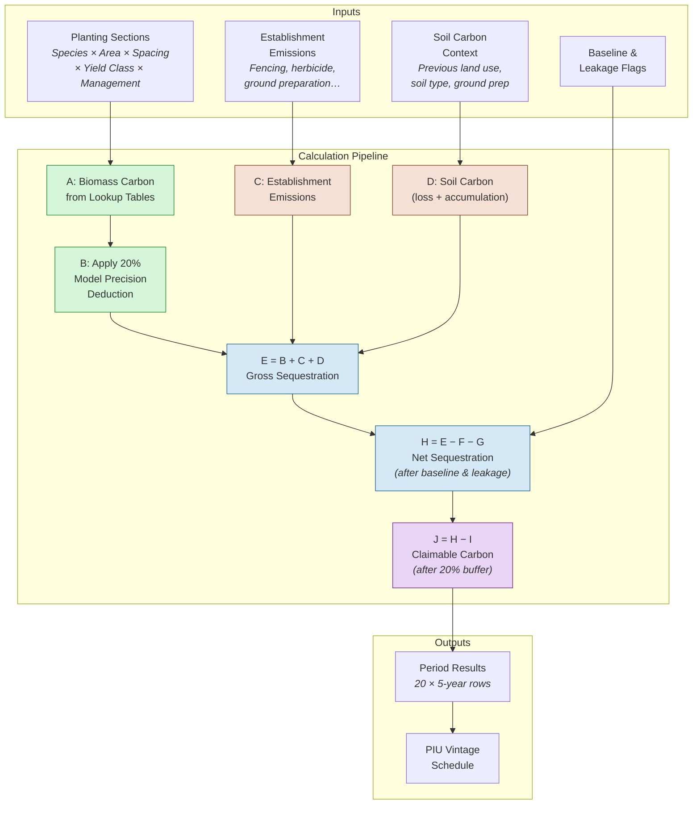
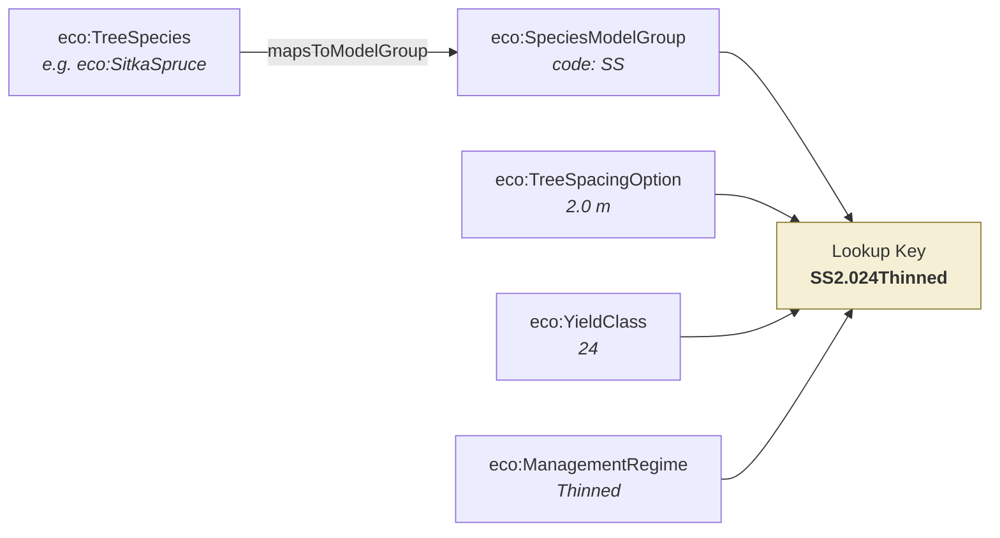
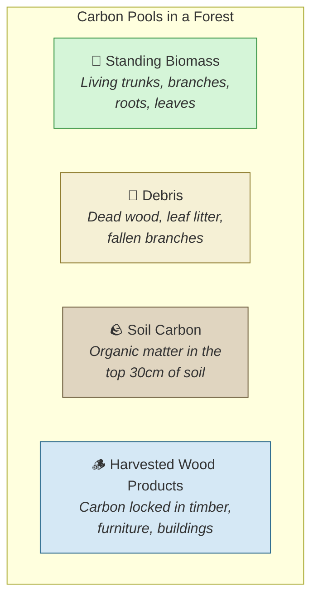
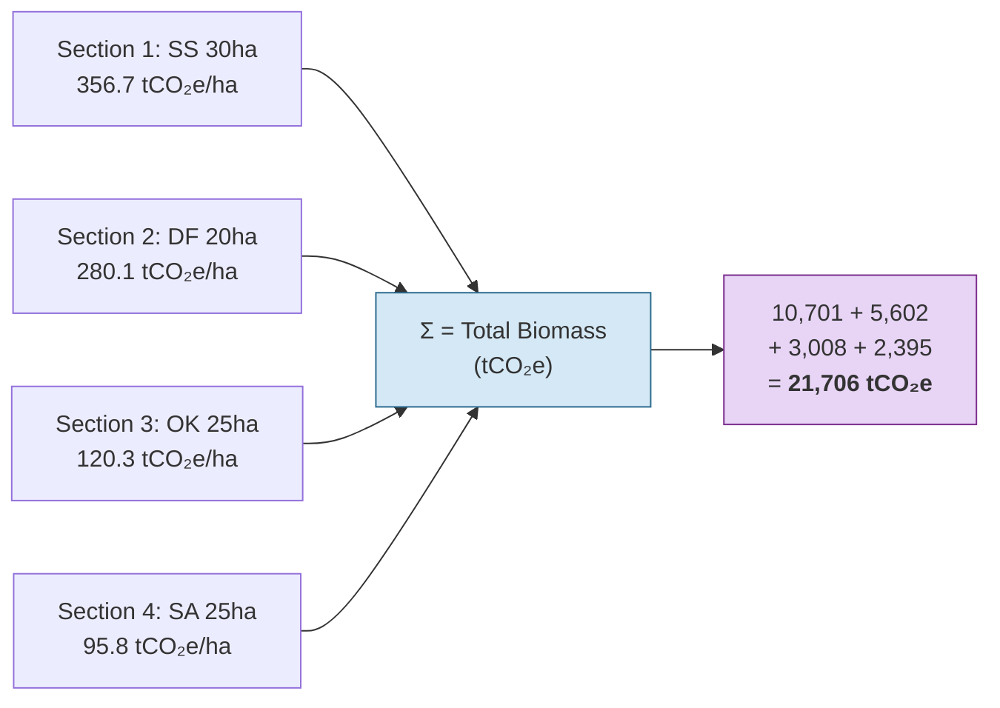
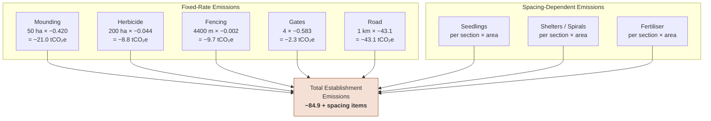
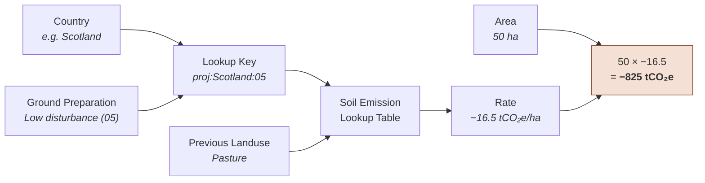
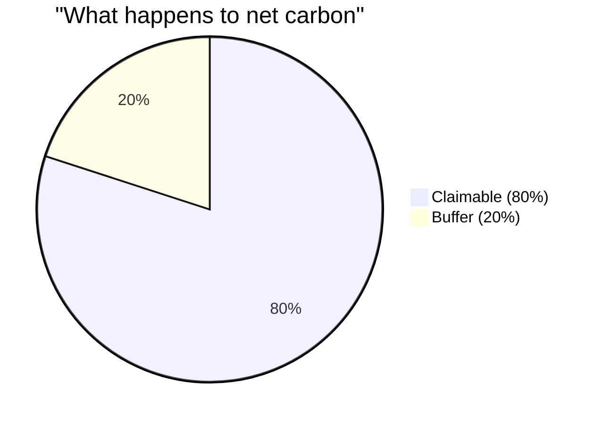
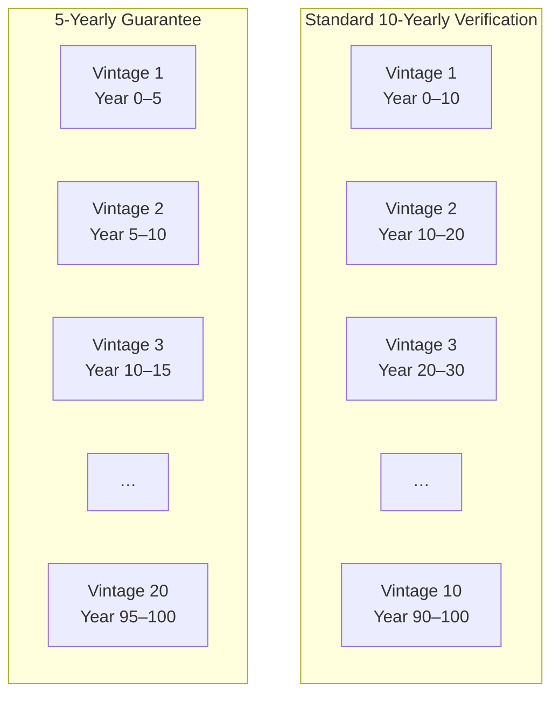
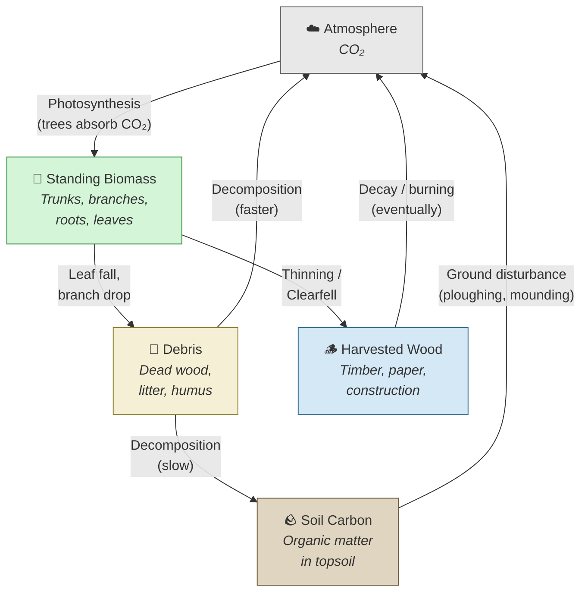

# How the Carbon Calculator Works

A comprehensive guide to the Woodland Carbon Code carbon calculation engine — what it calculates, why, and how, explained in terms of real-world ecology, forestry, and carbon science.

---

## Table of Contents

1. [The Big Picture](#the-big-picture)
2. [What Is Being Calculated?](#what-is-being-calculated)
3. [The Project: Describing a New Woodland](#the-project-describing-a-new-woodland)
4. [Step 1 — From Trees to Carbon Models](#step-1--from-trees-to-carbon-models)
5. [Step 2 — Biomass Carbon: How Trees Lock Up CO₂](#step-2--biomass-carbon-how-trees-lock-up-co2)
6. [Step 3 — Clearfell: When Trees Are Harvested](#step-3--clearfell-when-trees-are-harvested)
7. [Step 4 — Combining Sections into a Whole-Project Figure](#step-4--combining-sections-into-a-whole-project-figure)
8. [Step 5 — Model Precision Deduction](#step-5--model-precision-deduction)
9. [Step 6 — Establishment Emissions: The Carbon Cost of Planting](#step-6--establishment-emissions-the-carbon-cost-of-planting)
10. [Step 7 — Soil Carbon: Disturbance and Recovery](#step-7--soil-carbon-disturbance-and-recovery)
11. [Step 8 — Gross Sequestration: Adding It All Up](#step-8--gross-sequestration-adding-it-all-up)
12. [Step 9 — Baseline and Leakage Deductions](#step-9--baseline-and-leakage-deductions)
13. [Step 10 — The Buffer: Insurance Against Risk](#step-10--the-buffer-insurance-against-risk)
14. [Step 11 — PIU Vintage Schedule: When Carbon Credits Are Issued](#step-11--piu-vintage-schedule-when-carbon-credits-are-issued)
15. [End-to-End Worked Example](#end-to-end-worked-example)
16. [Carbon Pools — Where Does the Carbon Live?](#carbon-pools--where-does-the-carbon-live)
17. [Glossary](#glossary)

---

## The Big Picture

Trees absorb carbon dioxide (CO₂) from the atmosphere through photosynthesis. They split the CO₂ molecule, release the oxygen, and incorporate the carbon into their wood, bark, roots, and leaves. When someone plants a new woodland on land that was previously farmland or open ground, the growing trees gradually draw down atmospheric CO₂ and lock it away in biological matter. This process is called **carbon sequestration**.

The Woodland Carbon Code (WCC) is the UK's quality standard for woodland creation projects that claim carbon benefits. Before a single tree is planted, the project developer runs the **carbon calculator** to predict how much CO₂ the new woodland will capture over its lifetime (up to 100 years). That prediction determines how many tradeable carbon units — called **Pending Issuance Units (PIUs)** — can be registered against the project.

The calculator's job is therefore to answer one question:

> **"Given the species being planted, the site conditions, and the management plan, how much net carbon will this woodland sequester over a 100-year period, and how should those carbon credits be scheduled?"**

The answer is not a single number. It is a timeline of 20 five-year periods, each with a cumulative carbon total, adjusted for the emissions caused by creating the woodland, soil disturbance, model uncertainty, and risk.


---

## What Is Being Calculated?

The calculator produces a **`CarbonCalculation`** — a complete set of results for a **`WoodlandCreationProject`**. The calculation contains:

- **20 `CarbonPrediction` rows** — one for each 5-year **`GrowthPeriod`** from year 0–5 through year 95–100. Each prediction is a cumulative snapshot: "by year X, this woodland will have sequestered Y tonnes of CO₂-equivalent."
- **A `PIUVintageSchedule`** — a series of **`PIUVintage`** allocations that determine when and how many carbon credits the project earns at each verification point.

Every number in the calculation is expressed in **tCO₂e** — tonnes of carbon dioxide equivalent. This is the standard unit for greenhouse gas accounting. One tonne of CO₂e represents the climate impact of releasing one tonne of CO₂ into the atmosphere (or, equivalently, the benefit of removing one tonne).

The following diagram shows the high-level calculation pipeline — each step feeds into the next:



The letters A through K in the pipeline match the column labels used in the official WCC Standard Carbon Calculator spreadsheet, and correspond to the properties defined in the **Calculation Ontology** (`calc:`):

| Label | Ontology Property | Meaning |
|-------|-------------------|---------|
| A | `calc:cumulativeCarbonFromLookups` | Raw biomass carbon from lookup tables |
| B | `calc:cumulativeCarbonLess20Pct` | A × 0.8 (model precision deduction) |
| C | `calc:establishmentEmissionsContribution` | One-time CO₂ cost of site preparation |
| D | `calc:cumulativeSoilCarbon` | Soil carbon loss at year 0 + gradual accumulation |
| E | `calc:totalProjectSequestration` | B + C + D |
| F | `calc:baselineDeduction` | What the land would have sequestered anyway |
| G | `calc:leakageDeduction` | Emissions displaced outside the project boundary |
| H | `calc:netProjectSequestration` | E − F − G |
| I | `calc:bufferContribution` | 20% of H withheld as insurance |
| J | `calc:claimableSequestration` | H − I (the carbon credits) |
| K | `calc:averageClaimablePerHectare` | J ÷ net area |

---

## The Project: Describing a New Woodland

Before the calculator can run, the project must be described. In the data model, a **`proj:WoodlandCreationProject`** captures everything the calculator needs to know:

### Planting Sections

A project is divided into up to 25 **`proj:PlantingSection`** areas. Each section represents a uniform block of planting — same species, same spacing, same management. Think of it as: "In this 30-hectare corner of the site, we will plant Sitka spruce at 2-metre spacing, managed with thinning."

Each section specifies:

| Property | Ontology | Real-world meaning |
|----------|----------|--------------------|
| Species | `proj:hasSpecies` → `eco:TreeSpecies` | Which tree species: oak, birch, Sitka spruce, etc. |
| Spacing | `proj:hasPlannedSpacing` | How far apart the trees are planted (in metres) |
| Yield class | `eco:hasYieldClass` → `eco:YieldClass` | How fast the trees grow in this location (m³/ha/yr) |
| Management | `eco:hasManagementRegime` | Thinned or unthinned (No_thin) |
| Area | `proj:hasSectionArea` | How many hectares |
| Clearfell age | `proj:hasClearfellAge` | If/when the trees will be felled and replanted |

### Other Project Components

```mermaid
graph TB
    Project["WoodlandCreationProject<br/><i>proj:projectName<br/>proj:hasCountry<br/>proj:hasNetArea</i>"]

    Project --> PS1["PlantingSection 1<br/><i>Oak, 3m, YC4, No_thin, 50ha</i>"]
    Project --> PS2["PlantingSection 2<br/><i>Birch, 3m, YC6, No_thin, 30ha</i>"]
    Project --> PS3["PlantingSection …"]
    Project --> NR["NaturalRegeneration<br/><i>20ha broadleaf regen</i>"]
    Project --> WS["WoodyShrubs<br/><i>5ha hawthorn/blackthorn</i>"]
    Project --> EI["EstablishmentEmissionItems<br/><i>Fencing, herbicide, mounding…</i>"]
    Project --> SCE["SoilCarbonEntries<br/><i>Pasture → mineral soil,<br/>low disturbance, 50ha</i>"]
    Project --> SCA["SoilCarbonAccumulation<br/><i>Eligible area for soil C gain</i>"]
    Project --> BnL["BaselineAndLeakage<br/><i>Significant? Yes/No</i>"]

    style Project fill:#d5e8f5,stroke:#2d6b8e
    style PS1 fill:#d5f5d8,stroke:#2d8e3b
    style PS2 fill:#d5f5d8,stroke:#2d8e3b
    style PS3 fill:#d5f5d8,stroke:#2d8e3b
    style NR fill:#e8f5d5,stroke:#5a8e2d
    style WS fill:#e8f5d5,stroke:#5a8e2d
    style EI fill:#f5e0d5,stroke:#8e4b2d
    style SCE fill:#f5e0d5,stroke:#8e4b2d
    style SCA fill:#f5e0d5,stroke:#8e4b2d
    style BnL fill:#f5f0d5,stroke:#8e7b2d
```



- **`proj:NaturalRegeneration`** — areas where trees will regenerate naturally (no planting). These contribute to the project area but are modelled differently from planted sections.
- **`proj:WoodyShrubs`** — areas of shrubby species like hawthorn or gorse that contribute to biodiversity but are not included in the carbon lookup models.
- **`proj:EstablishmentEmissionItem`** — each activity that produces CO₂ during site preparation (building fences, spraying herbicide, building roads, etc.).
- **`proj:SoilCarbonEntry`** — describes what the soil is like and what it was used for before, which determines how much carbon is released when the ground is disturbed.
- **`proj:SoilCarbonAccumulation`** — the area of mineral soil (previously arable) that will gradually regain carbon as the woodland matures.
- **`proj:BaselineAndLeakage`** — flags for whether the land was already sequestering carbon (baseline) or whether planting here will cause emissions elsewhere (leakage).

---

## Step 1 — From Trees to Carbon Models

Not every tree species has its own unique carbon growth model. The UK Forestry Commission groups similar species together into **Species Model Groups** (`eco:SpeciesModelGroup`). For example:

- **Beech** and **sweet chestnut** share the model group code **`BE`**
- **Birch (downy/silver)** and **common alder** share the model group code **`SA`** (Sycamore, Ash, Birch group)
- **Sitka spruce** has its own group: **`SS`**
- **Oak (robur/petraea)** has its own group: **`OK`**

The relationship is modelled in the ontology as:

```
eco:TreeSpecies --[eco:mapsToModelGroup]--> eco:SpeciesModelGroup
```

When the calculator receives a planting section with species "Beech", it first resolves this to the `BE` model group.

### Why grouping matters

Forestry researchers have measured carbon uptake rates for representative species over decades. Rather than maintaining separate models for hundreds of individual species (many of which grow at similar rates), the Forestry Commission groups species that behave similarly and publishes a single set of carbon lookup tables per group. This is a pragmatic scientific simplification — the growth model for beech is close enough to sweet chestnut that one set of tables serves both.

### Building the lookup key

Once the species is resolved to a model group, the calculator constructs a **composite lookup key** that uniquely identifies the carbon growth curve for this section:

```
{modelCode}{spacing}{yieldClass}{managementRegime}
```

For example, if you are planting **Sitka spruce** at **2.0 m spacing**, yield class **24**, with **thinning**:

```
SS2.024Thinned
```

Or **oak** at **3.0 m spacing**, yield class **4**, **no thinning**:

```
OK3.004No_thin
```

This key is used to look up values from the biomass carbon table and the clearfell maximum sequestration table.



### Spacing resolution

Each species model group has a defined set of available spacings (`eco:hasAvailableSpacing`). If the user requests a spacing of 2.0 m but the model group only offers 1.7 m and 2.5 m, the calculator picks the **closest available spacing** (1.7 m in this case). This ensures the lookup key always maps to a valid entry in the biomass table.

---

## Step 2 — Biomass Carbon: How Trees Lock Up CO₂

This is the heart of the calculation: **how much carbon do the trees actually absorb?**

### The science behind the lookup tables

When a tree grows, it takes in CO₂ through tiny pores in its leaves (stomata) and, through photosynthesis, converts the carbon into cellulose, lignin, and other organic molecules that make up wood, bark, roots, and leaf tissue. Over time, a growing forest accumulates more and more carbon in its living and dead biomass.

Forestry scientists have measured carbon uptake rates for UK tree species over many decades, using permanent sample plots and growth models. These measurements have been compiled into **biomass carbon lookup tables** (`calc:BiomassLookupEntry`) — essentially a giant reference sheet that says:

> *"If you plant species group X, at Y metres apart, with yield class Z, under management regime W, then by year T the cumulative carbon sequestration will be N tonnes of CO₂e per hectare."*

Each entry in the lookup table tracks carbon across multiple **carbon pools** (`eco:CarbonPool`):



| Carbon Pool | What it is in the real world | How it works |
|-------------|------------------------------|--------------|
| **Standing Biomass** | The living trees — trunks, branches, roots, leaves | Grows as the trees grow; the main carbon store |
| **Debris** | Dead wood, fallen branches, leaf litter on the forest floor | Accumulates as the forest matures; decomposes slowly |
| **Soil Carbon** | Organic matter incorporated into the top 30 cm of soil | Handled separately — see [Step 7](#step-7--soil-carbon-disturbance-and-recovery) |
| **Harvested Wood Products** | Carbon in timber removed during thinning or felling | Credited only if the wood remains in long-lived products |

The biomass lookup table gives a **cumulative total sequestration** (`calc:cumulativeTotalSequestration`) per hectare for each 5-year period. This is the sum of carbon gained through tree growth, minus any carbon released through management operations (e.g. the carbon cost of chainsaw fuel during thinning), expressed in tCO₂e/ha.

### How the calculator uses the lookup tables

For each planting section, the calculator:

1. Constructs the lookup key (as described in Step 1)
2. Appends the period start year (e.g. `000` for year 0–5, `005` for year 5–10, etc.)
3. Looks up the cumulative tCO₂e/ha value for that section × period combination
4. Multiplies by the section area to get total tCO₂e for that section

For example, if the lookup table says **Sitka spruce SS2.024Thinned** at period 20–25 has sequestered **356.7 tCO₂e/ha**, and the section is **30 hectares**, the total biomass contribution from that section at year 25 is:

$$356.7 \times 30 = 10{,}701 \text{ tCO₂e}$$

---

## Step 3 — Clearfell: When Trees Are Harvested

Some woodland management plans include **clearfelling** — cutting down all the trees in a section at a certain age and replanting. This is common practice for commercial conifer species like Sitka spruce or Douglas fir, where the timber is harvested for construction, paper, or biomass energy.

### The real-world impact

When a forest is clearfelled:
- The standing biomass is removed (the carbon leaves the forest, though some remains locked in timber products)
- The debris pool is disturbed
- The replanted trees start the growth cycle again from zero

From a carbon crediting perspective, the woodland cannot continue claiming ever-increasing carbon sequestration after clearfell. The calculation must recognise that carbon stocks will be **capped** at the clearfell age.

### How the calculator handles clearfell

The calculator uses a **clearfell maximum sequestration table** (`calc:ClearfellMaxSequestration`). For each combination of species, spacing, yield class, and management regime, this table gives a **cap** — the maximum tCO₂e/ha that the woodland can claim at a given clearfell rotation age.

If a section specifies a clearfell age (e.g. 40 years), the calculator:

1. Looks up the clearfell cap for that lookup key at that rotation age
2. For every period, caps the biomass-per-hectare to the clearfell cap value
3. If the uncapped biomass from the lookup table exceeds the cap, the cap is applied


Conceptually, the growth trajectory looks like this:

```
tCO₂e/ha
    ▲
    │                              ╭──── Uncapped: trees keep growing
    │                         ╭───╯
    │                    ╭───╯
    │              ╭────╯
    │         ╭───╯  ← Clearfell cap at age 40
    │    ╭───╯· · · · · · · · · · · · · · ← Capped: flat line after clearfell
    │  ╭╯
    │╭╯
    ├──────────────────────────────────────────► Years
    0    10    20    30    40    50    60    70
```

The broadleaved sections in the same project (like oak or birch, which are not clearfelled) continue to accumulate carbon beyond the clearfell age, so the **total** project carbon still increases — just more slowly after the conifers hit their cap.

---

## Step 4 — Combining Sections into a Whole-Project Figure

A real project typically contains multiple planting sections — perhaps Sitka spruce on one slope, oak in the valley, and birch on the wetter ground. Each grows at a different rate and stores carbon differently.

The calculator computes biomass carbon **per section** and then sums them to get the **whole-project biomass total** for each period:

$$A_{\text{period}} = \sum_{\text{sections}} \left( \text{biomass per ha}_{\text{section, period}} \times \text{area}_{\text{section}} \right)$$

This gives the **area-weighted total biomass carbon** across all sections. The result is stored as `calc:cumulativeCarbonFromLookups` (column A in the WCC spreadsheet).



---

## Step 5 — Model Precision Deduction

The biomass carbon lookup tables are derived from forestry growth models — mathematical approximations of biological reality. No model is perfect. Trees grow differently depending on local soil, microclimate, deer damage, disease, drought, and countless other factors that cannot all be captured in a standardised table.

To account for this inherent model uncertainty, the WCC applies a **20% model precision deduction**. The raw biomass total is multiplied by **0.8**:

$$B = A \times 0.8$$

This is a conservative, precautionary adjustment. It means the calculator only credits 80% of the modelled carbon uptake, providing a safety margin against over-prediction. The ontology records this as `calc:cumulativeCarbonLess20Pct`.

> **Real-world analogy:** If a weather forecast predicts 100 mm of rain, an engineer designing a drainage system might design for only 80 mm as the "likely" amount, while keeping the full 100 mm in mind as a possibility. The 20% deduction serves a similar function — it keeps the carbon prediction conservative and credible.

---

## Step 6 — Establishment Emissions: The Carbon Cost of Planting

Creating a woodland is not carbon-free. Before a single tree starts absorbing CO₂, the project generates emissions through site preparation activities. These are **establishment emissions** (`proj:EstablishmentEmissionItem`), and they represent real greenhouse gas releases that must be subtracted from the eventual carbon gains.

### Sources of establishment emissions

The calculator handles two categories of establishment emissions:

#### Fixed-rate emissions (from `proj:EstablishmentEmissionType`)

These have a known emission factor per unit of activity:

| Activity | Emission Rate | Unit | What happens in the real world |
|----------|--------------|------|-------------------------------|
| **Mounding** | −0.420 tCO₂e/ha | per hectare | Diesel machinery creates raised mounds for planting — burns fuel and disturbs soil |
| **Scarifying** | −0.052 tCO₂e/ha | per hectare | Machine-dragged tools scratch the soil surface to prepare planting spots |
| **Ploughing** | −0.069 tCO₂e/ha | per hectare | Turning the soil over with a plough — less intensive than mounding |
| **Subsoiling** | −0.173 tCO₂e/ha | per hectare | Breaking up compacted soil layers with a deep ripper |
| **Herbicide** | −0.044 tCO₂e/ha | per hectare | Manufacturing and applying herbicide to suppress competing vegetation |
| **Fencing** | −0.002 tCO₂e/m | per metre | Manufacturing steel/wire fencing and driving posts to protect from deer |
| **Gates** | −0.583 tCO₂e/each | per gate | Manufacturing and installing each gate |
| **Road building** | −43.13 tCO₂e/km | per kilometre | Quarrying aggregate, diesel for machinery, building a forest access road |

> Note: All emission rates are **negative** because they represent CO₂ released into the atmosphere (a debit against the carbon balance).

#### Spacing-dependent emissions (auto-calculated)

Some emissions depend on how closely the trees are planted, because closer spacing means more trees (and more materials) per hectare. These are calculated automatically from the `eco:TreeSpacingOption`:

| Activity | Depends on | Real-world explanation |
|----------|------------|----------------------|
| **Seedlings** | `eco:seedlingRate` | Growing seedlings in a nursery requires heated greenhouses, peat-based compost, irrigation, and transport — more trees per hectare means more nursery emissions |
| **Tree shelters** | `eco:ShelterRate` | Plastic tubes placed around each seedling to protect from browsing animals and wind — more trees require more tubes |
| **Spiral guards** | `eco:SpiralGuardRate` | Plastic spirals wrapped around stems to deter vole and rabbit damage |
| **Voleguards** | `eco:voleguardRate` | Mesh guards at the base of each tree to protect against field voles |
| **Fertiliser** | `eco:fertiliserRate` | Manufacturing nitrogen fertiliser is energy-intensive — more trees means more fertiliser applied |

The total establishment emissions are computed once and applied as a **one-time cost** in the calculation. Since the per-period results are **cumulative** (showing total carbon from project start to year X), the establishment emissions appear as a constant negative value subtracted from every period.



---

## Step 7 — Soil Carbon: Disturbance and Recovery

Soil is the world's largest terrestrial carbon store. The top 30 cm of soil contains vast amounts of organic carbon, accumulated over centuries from decomposed plant material. When land is disturbed — ploughed, mounded, or drained — some of that stored carbon is released back into the atmosphere as CO₂.

The calculator models soil carbon in two parts:

### Part 1: Soil carbon emission at year 0

When the ground is prepared for planting, some soil carbon is lost. The amount depends on three factors:

- **Country** — England, Scotland, Wales, and Northern Ireland have different baseline soil carbon levels (reflecting different climates, rainfall, and geology)
- **Ground preparation method** (`eco:GroundPreparationMethod`) — how aggressively the soil is disturbed:
  - *None / Negligible* (code `00`) — hand screefing only, virtually no carbon loss
  - *Low disturbance* (code `05`) — hand turfing, patch scarification, subsoiling
  - *Medium disturbance* (code `10`) — shallow ploughing, disc mounding
  - *High disturbance* (code `20`) — deep ploughing
  - *Very high disturbance* (code `40`) — agricultural ploughing
- **Previous land use** (`eco:PreviousLanduse`) — what the land was used for before the woodland:
  - *Arable* — regularly ploughed cropland (lower soil carbon — much has already been lost to cultivation)
  - *Pasture* — grazing land (moderate soil carbon)
  - *Seminatural* — unimproved grassland, heath, or scrub (highest soil carbon — least disturbed)

The calculator looks up the soil emission rate from a reference table (`calc:SoilEmissionLookupEntry`) indexed by country and ground preparation code, then selects the rate for the specific previous land use. It multiplies this rate by the area to get total soil emission:

$$\text{Soil emission} = \text{rate (tCO₂e/ha)} \times \text{area (ha)}$$

A project can have up to 6 soil carbon entries (`proj:SoilCarbonEntry`), each representing a different combination of soil type, previous land use, and preparation method across different parts of the site.



### Part 2: Soil carbon accumulation over time

Under certain conditions, the growing woodland gradually rebuilds soil carbon. Leaf litter falls, roots die and decompose, and organic matter is incorporated back into the soil. The WCC recognises this accumulation **only** when three conditions are met:

1. The soil is **mineral** (not peat or organo-mineral)
2. The previous land use was **arable** (i.e. the soil has been depleted by cultivation)
3. The management is **minimum intervention** (no further soil disturbance)

When these conditions are met, the calculator applies a **cumulative accumulation rate** (`calc:SoilCarbonAccumulationRate`) per hectare for each 5-year period. Example accumulation values:

| Period | Cumulative tCO₂e/ha |
|--------|---------------------|
| 0–5 | 2.75 |
| 5–10 | 5.50 |
| 10–15 | 8.25 |
| 15–20 | 11.00 |
| … | … (increasing by ~2.75 per period) |
| 95–100 | 55.00 |

The total soil carbon (`calc:cumulativeSoilCarbon`) for each period is:

$$D = \text{soil emission at year 0} + \text{cumulative accumulation at period } n$$

---

## Step 8 — Gross Sequestration: Adding It All Up

The gross sequestration (`calc:totalProjectSequestration`) combines all three carbon streams:

$$E = B + C + D$$

Where:
- **B** = biomass carbon (after 20% model precision deduction)
- **C** = establishment emissions (always negative — a one-time carbon debt)
- **D** = soil carbon (emission at year 0 + accumulation over time)

In the early years, the total may be **negative** — the carbon cost of establishing the woodland exceeds the carbon absorbed by the young trees. This is normal and expected. Young trees grow slowly, and it takes several years before the cumulative biomass gains overtake the one-time establishment costs.

```
tCO₂e
(cumulative)
    ▲
    │                                          ╭────── Total grows steadily
    │                                    ╭────╯
    │                              ╭────╯
    │                        ╭────╯
    │                  ╭────╯
    │            ╭────╯
    │      ╭────╯
    │ ╭───╯
    ──┼──╯──────────────────────────────────────► Years
    │╯  ← Negative in early years
    │     (establishment costs
    │      exceed tree growth)
    │
```

---

## Step 9 — Baseline and Leakage Deductions

### Baseline

The **baseline** (`proj:isBaselineSignificant`) asks: *"Would this land have sequestered carbon even without the project?"*

If the answer is yes — for example, if the land had naturally regenerating scrub that was already accumulating carbon — then the project cannot claim credit for carbon that would have been sequestered anyway. A **baseline deduction** is applied.

In practice, most WCC projects are on land with no significant natural carbon sequestration (bare agricultural land, improved pasture), so this deduction is usually zero.

### Leakage

**Leakage** (`proj:isLeakageSignificant`) asks: *"Does this project cause emissions outside its boundary?"*

For example, if a farmer converts productive pasture to woodland and then clears scrubland elsewhere to replace the lost grazing, the emissions from clearing that scrubland are "leakage" — carbon displaced rather than truly sequestered.

If leakage is flagged as significant, a deduction is applied.

Net sequestration after these adjustments:

$$H = E - F - G$$

Where F is the baseline deduction and G is the leakage deduction.

---

## Step 10 — The Buffer: Insurance Against Risk

Forests face risks: wildfire, disease (e.g. ash dieback, Phytophthora), wind damage, drought, insect pests, and management failure. The WCC addresses this by requiring that **20% of the net carbon** is withheld in a **buffer pool** for 100 years:

$$I = H \times 0.20$$
$$J = H - I$$

The buffer contribution is recorded as `calc:bufferContribution`. The remaining 80% is the **claimable sequestration** (`calc:claimableSequestration`) — the carbon credits the project can actually sell or trade.

The buffer exists as a collective insurance pool across all WCC projects. If one project suffers a loss (e.g. a wildfire destroys 40% of the trees), the buffer pool can absorb the loss without invalidating carbon credits that have already been sold from other projects.

> **Why 20%?** Analysis of UK forestry risk data — windthrow, fire, pest and disease, and management failure — suggests that a 15–20% pool is sufficient to cover expected losses across the portfolio of WCC projects over 100 years. The 20% figure provides a conservative safety margin.



---

## Step 11 — PIU Vintage Schedule: When Carbon Credits Are Issued

Carbon credits are not issued all at once. They are distributed across the project's lifetime as **Pending Issuance Units (PIUs)** in a **vintage schedule** (`calc:PIUVintageSchedule`).

### Verification schemes

There are two schemes (`proj:VerificationScheme`):

| Scheme | Verification frequency | Vintages | Typical use |
|--------|----------------------|----------|-------------|
| **Standard** | Every 10 years | 10 vintages across 100 years | Most WCC projects |
| **Woodland Carbon Guarantee** | Every 5 years | 20 vintages across 100 years | England-only government scheme that offers a guaranteed price per tCO₂e |

### How PIUs are allocated

At each verification point, the calculator determines how many **new** PIUs to issue:

1. Look at the cumulative claimable carbon (J) at the end of this verification period
2. Subtract the total PIUs already issued in previous vintages
3. The difference is the **increment** — the new PIUs for this vintage

PIUs can never be negative. If the cumulative claimable carbon at a verification point is less than the total PIUs already issued (which could happen theoretically due to rounding), no new PIUs are issued for that vintage.



### PIUs vs. WCUs

A PIU is a *promise* — it represents carbon that is *predicted* to be sequestered in the future. When the project reaches a verification point and an independent auditor confirms that the trees have actually grown as predicted, the PIUs are converted into **Woodland Carbon Units (WCUs)** — verified, permanent carbon credits. This conversion happens outside the calculator.

---

## End-to-End Worked Example

Let us trace through a simplified calculation for a project with two planting sections on 100 hectares in Scotland:

**Project setup:**
- Section 1: 50 ha of Sitka spruce (SS), 2.0 m spacing, YC 24, Thinned, clearfell at age 40
- Section 2: 50 ha of Oak (OK), 3.0 m spacing, YC 4, No_thin
- Establishment: mounding 100 ha, herbicide 200 ha, fencing 4400 m, 4 gates
- Soil: 100 ha organomineral pasture, low disturbance (Scotland)
- No baseline or leakage

**Step 1 — Resolve species and build lookup keys:**
- SS → model code `SS`, key: `SS2.024Thinned`
- OK → model code `OK`, key: `OK3.004No_thin`

**Step 2 — Look up biomass at, say, year 25 (period 5):**
- SS: say 400 tCO₂e/ha × 50 ha = 20,000 tCO₂e
- OK: say 100 tCO₂e/ha × 50 ha = 5,000 tCO₂e
- Total biomass (A) = 25,000 tCO₂e

**Step 3 — Clearfell (applies later):**
- SS clearfell cap at age 40 might be 350 tCO₂e/ha — at year 25 this is not yet limiting

**Step 5 — Model precision deduction:**
- B = 25,000 × 0.8 = 20,000 tCO₂e

**Step 6 — Establishment emissions:**
- Mounding: 100 × −0.420 = −42.0
- Herbicide: 200 × −0.044 = −8.8
- Fencing: 4400 × −0.002 = −9.7
- Gates: 4 × −0.583 = −2.3
- Seedlings (auto): say −37.5 per section × 2 = −75.0 (depends on spacing)
- Total (C) = −137.8 tCO₂e

**Step 7 — Soil carbon:**
- Soil emission at year 0: 100 ha × −29.3 tCO₂e/ha = −2,930 tCO₂e
- Accumulation at year 25: 0 (organomineral soil with pasture — does not qualify)
- Total soil (D) = −2,930 tCO₂e

**Step 8 — Gross sequestration:**
- E = B + C + D = 20,000 + (−137.8) + (−2,930) = 16,932 tCO₂e

**Step 9 — Baseline and leakage:**
- Neither significant → F = 0, G = 0
- H = 16,932 tCO₂e

**Step 10 — Buffer:**
- I = 16,932 × 0.20 = 3,386 tCO₂e
- J = 16,932 − 3,386 = **13,546 tCO₂e claimable** at year 25

**Step 11 — Vintages:**  
At the 10-year verification for years 20–30, the PIU increment would be 13,546 minus whatever PIUs were already issued in the year 0–10 and 10–20 vintages.

---

## Carbon Pools — Where Does the Carbon Live?

Understanding the physical reality behind the numbers helps explain why different parts of the calculation exist. The following diagram shows where carbon resides in a woodland ecosystem, and how it flows:



**Key carbon flows:**

1. **Atmosphere → Standing biomass** (photosynthesis) — the primary mechanism. Trees pull CO₂ from the air and build it into wood.
2. **Standing biomass → Debris** (natural mortality) — leaves fall, branches break, some trees die. This material decomposes slowly, releasing carbon back to the atmosphere, but much of it passes into the soil.
3. **Debris → Soil** (decomposition) — organic matter is incorporated into the mineral soil over decades.
4. **Standing biomass → Harvested wood** (thinning/clearfell) — carbon stays locked in timber products for years or decades, but eventually decays or is burned.
5. **Soil → Atmosphere** (disturbance) — when land is ploughed or mounded, soil carbon is exposed to oxygen and decomposes, releasing CO₂. This is why ground preparation is an emission source.

The calculator's job is to track net accumulation across all these pools except soil (which is handled separately) and express the 100-year outcome in a form suitable for carbon credit issuance.

---

## Glossary

| Term | Meaning |
|------|---------|
| **tCO₂e** | Tonnes of carbon dioxide equivalent — the standard unit for greenhouse gas accounting. 1 tCO₂e = the climate impact of releasing 1 tonne of CO₂. |
| **Sequestration** | The process of capturing atmospheric CO₂ and storing it in a long-term reservoir (e.g. tree biomass, soil). |
| **Yield class** | A measure of how fast trees grow at a particular site, expressed as the maximum mean annual increment of timber volume (m³/ha/yr). Higher yield class = faster growth = more carbon. |
| **Spacing** | The distance between planted trees (in metres). Closer spacing means more trees per hectare but also more competition and more establishment emissions. |
| **Clearfell** | Harvesting all trees in an area at a specified age, typically followed by replanting. Common in commercial conifer forestry. |
| **PIU** | Pending Issuance Unit — a forward-looking carbon credit representing predicted future sequestration. Not yet verified. |
| **WCU** | Woodland Carbon Unit — a verified carbon credit, confirmed by audit. PIUs convert to WCUs at verification. |
| **Buffer** | A percentage of carbon credits withheld as insurance against project failure (fire, disease, storm damage). |
| **Model precision deduction** | A 20% reduction applied to modelled biomass carbon to account for uncertainty in growth models. |
| **Baseline** | The carbon sequestration that would have occurred on the land without the project. Deducted to ensure the project only claims credit for *additional* carbon. |
| **Leakage** | Emissions caused outside the project boundary as a consequence of the project (e.g. displacing farming to other land). |
| **Species model group** | A grouping of tree species that share the same carbon growth model (e.g. beech and sweet chestnut are both modelled using the `BE` group). |
| **Management regime** | Whether the forest is thinned (selective removal of trees to improve growth of remaining trees) or unthinned (left to grow without intervention). |
| **Ground preparation** | Physical disturbance of the soil surface before planting — ranges from hand screefing (minimal) to deep ploughing (severe). |
| **Vintage** | A specific time-period allocation of carbon credits within the PIU schedule. |
| **Verification** | Independent audit confirming that the woodland has grown as predicted. Triggers conversion of PIUs to WCUs. |
| **Woodland Carbon Code (WCC)** | The UK's voluntary carbon standard for woodland creation projects. Administered by Scottish Forestry. |
| **UK Land Carbon Registry** | The registry where WCC projects and their carbon units are recorded and tracked. |
