# Woodland Carbon Calculator V3.0 — Entity Relationship Diagram

This ERD represents the data model encoded in the **StandardProjectCarbonCalculator** worksheet of `CarbonCalculator_V3.0_August2025.xlsx`.

## Data Model Overview

The model captures four tables from the spreadsheet:

| Spreadsheet Area | Entities | Description |
|---|---|---|
| **Table 1** (cols A–E, rows 4–40) | `PROJECT`, `ESTABLISHMENT_EMISSIONS`, `SOIL_CARBON_ACCUMULATION`, `BASELINE_AND_LEAKAGE` | Project metadata, establishment emissions, soil carbon accumulation, baseline & leakage |
| **Table 2** (cols G–V, rows 4–33) | `PLANTING_SECTION`, `NATURAL_REGENERATION`, `WOODY_SHRUBS` | Up to 25 species/spacing/yield-class sections plus natural regen and woody shrubs |
| **Table 3** (cols A–J, rows 42–51) | `SOIL_CARBON_ENTRY` | Up to 6 landuse × soil type × ground preparation combinations |
| **Summary** (cols CB–CT, rows 4–55) | `CARBON_PREDICTION`, `PIU_VINTAGE` | 21 five-year period carbon predictions and PIU vintage allocations |

Reference/lookup entities (`SPECIES_LOOKUP`, `SPECIES_YC_RANGE`, `BIOMASS_CARBON_LOOKUP`, `TREE_SPACING`, `SOIL_EMISSION_LOOKUP`) are sourced from supporting worksheets.

## ERD Diagram

```mermaid
erDiagram
    PROJECT {
        string project_name "UK Land Carbon Registry name"
        string completed_by "Person completing form"
        date date_completed "Date calculation completed"
        string calculator_version "e.g. Version 3.0 August 2025"
        date start_date "Last day of planting"
        int duration_years "40-100 years"
        float net_area_ha "Total net woodland creation area"
        string country "England | Scotland | Wales | Northern Ireland"
        string woodland_carbon_guarantee "Yes | No | N/A (England only)"
        string verification_frequency "10-Yearly | 5-Yearly | N/A"
    }

    PLANTING_SECTION {
        int section_number "1-25 sections available"
        string species_name "From Species Lookup"
        float planned_spacing_m "User-entered spacing"
        string species_model "Mapped species code for lookup"
        float lookup_spacing_m "Spacing used in lookup tables"
        string yield_class_esc "Yield class from ESC"
        string lookup_yield_class "Yield class used in lookups"
        string management "No_thin | Thinned"
        float percentage_of_area "Pct of total project area"
        float area_ha "Calculated hectares"
        int age_at_clearfell "Multiple of 5 years"
        float clearfell_cap_tCO2e_ha "Max sequestration at clearfell"
    }

    NATURAL_REGENERATION {
        string regen_type "Broadleaves | Scots pine | Both"
        float area_ha "Area of natural regeneration"
    }

    WOODY_SHRUBS {
        string shrub_species "User-described species"
        float area_ha "Area of woody shrubs"
    }

    ESTABLISHMENT_EMISSIONS {
        float seedlings_area_ha "Area planted"
        float tree_shelters_1_2m_area_ha "1.2m shelter area"
        float spiral_guards_0_6m_area_ha "0.6m guard area"
        float voleguards_area_ha "Voleguard area"
        float fertiliser_area_ha "Fertiliser area"
        float mounding_area_ha "Mounding area"
        float scarifying_area_ha "Scarifying area"
        float ploughing_area_ha "Ploughing area"
        float subsoiling_area_ha "Subsoiling area"
        float herbicide_area_ha "Herbicide treated area"
        float fence_length_m "Length of fencing"
        int gate_count "Number of gates"
        float road_length_km "Length of road built"
        float vegetation_removal_tCO2e "Emissions from tree/veg removal"
        float total_emissions_tCO2e "Sum of all establishment emissions"
    }

    TREE_SPACING {
        float spacing_m "1.2 to 5.0m"
        float seedling_rate_tCO2e_ha "Emission per hectare"
        float shelter_1_2m_rate_tCO2e_ha "Tree shelter rate"
        float guard_0_6m_rate_tCO2e_ha "Spiral guard rate"
        float voleguard_rate_tCO2e_ha "Voleguard rate"
        float fertiliser_rate_tCO2e_ha "Fertiliser rate"
    }

    SOIL_CARBON_ENTRY {
        string previous_landuse "Arable | Pasture | Seminatural"
        string soil_type "Mineral | Organomineral"
        string ground_preparation "None to Very High Disturbance"
        float area_ha "Area for this combination"
        string pct_topsoil_carbon_lost "00 | 02 | 05 | 10 | 20 | 40"
        float soil_emissions_tCO2e_ha "Calculated per hectare"
        float soil_emissions_tCO2e "Calculated total"
    }

    SOIL_CARBON_ACCUMULATION {
        float area_ha "Mineral soil, previously arable, min intervention"
    }

    BASELINE_AND_LEAKAGE {
        string baseline_significant "Yes | No"
        string leakage_significant "Yes | No"
    }

    SPECIES_LOOKUP {
        string species_name "e.g. Alder, Beech, Birch"
        string species_code "e.g. AH, BE, BI"
        string latin_name "Scientific name"
        string species_model_code "BE CP DF EL GF HL JL LEC LP NF NS OK RC SAB SP SS WH"
    }

    SPECIES_YC_RANGE {
        string species_model_code "e.g. BE, CP, DF"
        string spacing_named_range "e.g. BE_SP"
        string yield_class_named_range "e.g. BE_YC"
        string available_spacings "Set of valid spacings"
        string available_yield_classes "Set of valid yield classes"
    }

    BIOMASS_CARBON_LOOKUP {
        string lookup_key "Species+Spacing+YC+Mgmt+Period"
        string species_code "e.g. BE, NS, SS"
        float spacing_m "Tree spacing"
        int yield_class "Numeric yield class"
        string management "NO_thin | Thinned"
        string period_year "5yr period e.g. 0-5, 5-10"
        float carbon_standing_tCO2e "Standing carbon per ha/yr"
        float debris_tCO2e "Debris carbon per ha/yr"
        float total_tCO2e "Total per ha/yr"
        float cumulative_in_period "tCO2e/ha per 5yr period"
        float cumulative_biomass "tCO2e/ha cumulative"
        float cumulative_mgmt_emissions "tCO2e/ha from management"
        float cumulative_total_seq "tCO2e/ha total sequestration"
        float removed_from_forest "tCO2e/ha/yr removed"
    }

    SOIL_EMISSION_LOOKUP {
        string lookup_code "Country + pct code"
        string country "England | Scotland | Wales | NI"
        string pct_topsoil_code "00 | 02 | 05 | 10 | 20 | 40"
        float seminatural_tCO2e_ha "Rate for seminatural"
        float pasture_tCO2e_ha "Rate for pasture"
        float arable_tCO2e_ha "Rate for arable"
    }

    CARBON_PREDICTION {
        string period "Year 0, 0-5, 5-10 ... 95-100"
        int cumulative_to_year "0, 5, 10 ... 100"
        float cum_carbon_from_lookups_tCO2e "A: Sum across sections"
        float cum_carbon_less_20pct_tCO2e "B: 80pct of A"
        float establishment_emissions_tCO2e "C: From Table 1"
        float cum_soil_carbon_tCO2e "D: Loss yr1 + accumulation"
        float total_project_seq_tCO2e "E = B + C + D"
        float baseline_tCO2e "F: Normally zero"
        float leakage_tCO2e "G: Normally zero"
        float net_project_seq_tCO2e "H = E + F - G"
        float buffer_contribution_tCO2e "I: 15-20pct of H"
        float claimable_seq_tCO2e "J = H - I"
        float avg_claimable_per_ha "K = J / Net Area"
    }

    PIU_VINTAGE {
        int years_since_start "Verification year"
        date vintage_start_date "Start of vintage period"
        date vintage_end_date "End of vintage period"
        float total_PIUs_tCO2e "Total PIUs in vintage"
        float buffer_contribution_tCO2e "Buffer deduction"
        float PIUs_to_project_tCO2e "Net PIUs to project"
    }

    PROJECT ||--|| ESTABLISHMENT_EMISSIONS : "has"
    PROJECT ||--|| SOIL_CARBON_ACCUMULATION : "has"
    PROJECT ||--|| BASELINE_AND_LEAKAGE : "has"
    PROJECT ||--|{ PLANTING_SECTION : "contains 1-25"
    PROJECT ||--o| NATURAL_REGENERATION : "may include"
    PROJECT ||--o| WOODY_SHRUBS : "may include"
    PROJECT ||--|{ SOIL_CARBON_ENTRY : "contains 1-6"
    PROJECT ||--|{ CARBON_PREDICTION : "generates 21 periods"
    PROJECT ||--|{ PIU_VINTAGE : "generates vintages"
    PLANTING_SECTION }|--|| SPECIES_LOOKUP : "selects species from"
    SPECIES_LOOKUP }|--|| SPECIES_YC_RANGE : "maps to model via"
    PLANTING_SECTION }|--|| BIOMASS_CARBON_LOOKUP : "lookups carbon from"
    ESTABLISHMENT_EMISSIONS }|--|| TREE_SPACING : "rates determined by"
    SOIL_CARBON_ENTRY }|--|| SOIL_EMISSION_LOOKUP : "rates from"
    CARBON_PREDICTION }|--|{ PLANTING_SECTION : "aggregates from"
    CARBON_PREDICTION ||--|| PIU_VINTAGE : "determines"
```

## Entity Descriptions

### Input Entities (user-provided data)

- **PROJECT** — Core project details: name, dates, country, duration, area, and guarantee options
- **PLANTING_SECTION** — Up to 25 rows defining species mix; each row specifies species, spacing, yield class, management regime, and area proportion
- **NATURAL_REGENERATION** — Optional area for future claimable natural regeneration (broadleaves, Scots pine, or both)
- **WOODY_SHRUBS** — Optional area for woody shrub species (not modelled in carbon lookup)
- **ESTABLISHMENT_EMISSIONS** — Areas/quantities for each emission source during woodland establishment (seedlings, tree protection, ground preparation, fencing, roads, herbicide, vegetation removal)
- **SOIL_CARBON_ENTRY** — Up to 6 rows covering each unique combination of previous landuse, soil type, and ground preparation method
- **SOIL_CARBON_ACCUMULATION** — Area eligible for soil carbon accumulation (mineral soil, previously arable, minimum intervention)
- **BASELINE_AND_LEAKAGE** — Flags for whether baseline or leakage adjustments apply

### Reference/Lookup Entities (from supporting worksheets)

- **SPECIES_LOOKUP** — Maps 135+ tree species names to one of 18 species model codes (from *Species lookup* sheet)
- **SPECIES_YC_RANGE** — Defines valid spacing and yield class options per species model (from *Species_YC_Ranges* sheet)
- **BIOMASS_CARBON_LOOKUP** — 19,000+ rows of cumulative carbon sequestration values by species, spacing, yield class, management, and 5-year period (from *Biomass carbon lookup table* sheet)
- **TREE_SPACING** — Emission rates per hectare for each tree spacing option (from *Validation lists* sheet)
- **SOIL_EMISSION_LOOKUP** — Soil carbon emission rates by country, ground disturbance level, and previous landuse (from *Validation lists* sheet)

### Calculated/Output Entities

- **CARBON_PREDICTION** — 21 rows (one per 5-year period from Year 0 to Year 100) summarising cumulative carbon sequestration with 20% model precision deduction, soil carbon, baseline/leakage adjustments, and buffer contributions
- **PIU_VINTAGE** — Pending Issuance Units allocated by vintage period, with two versions available (standard 10-yearly or 5-yearly for Woodland Carbon Guarantee)
